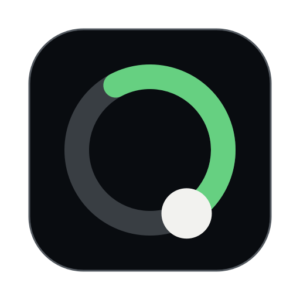
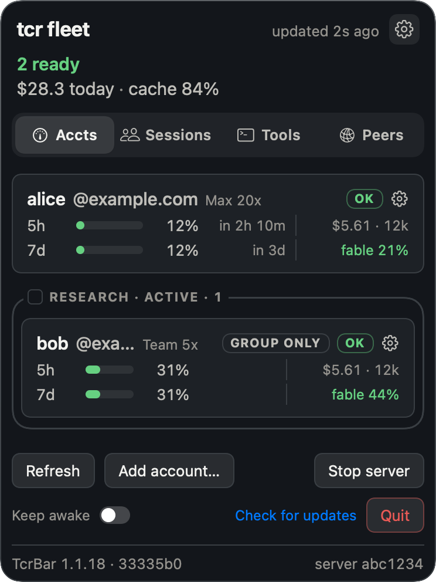
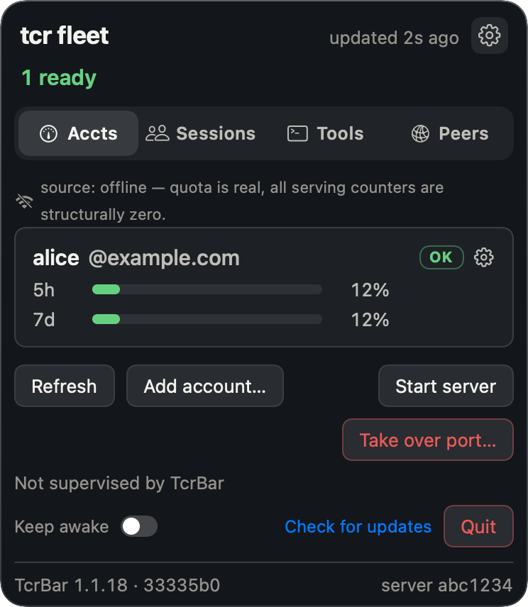
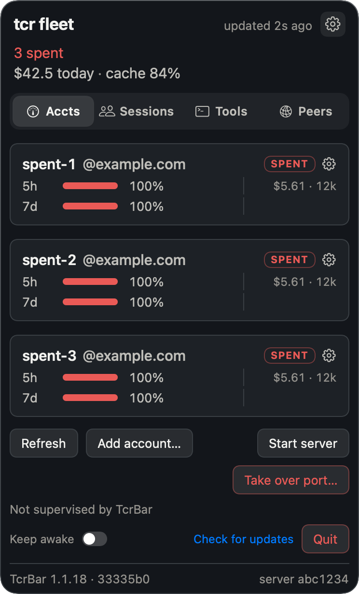
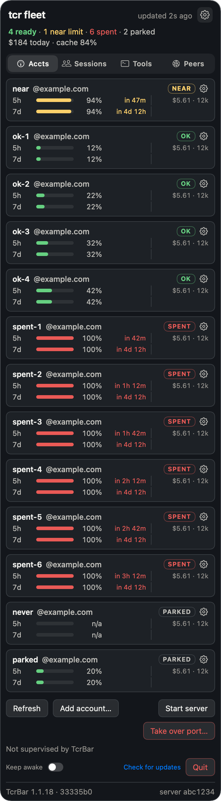
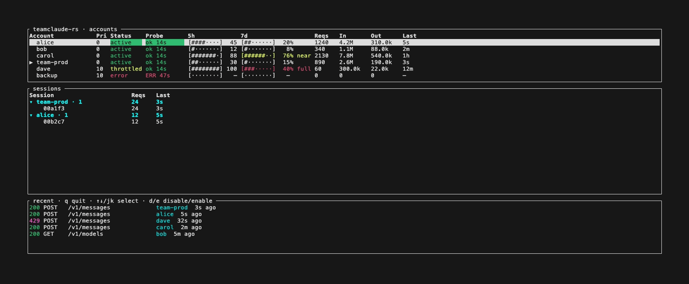

<div align="center">



# teamclaude-rs (`tcr`)

A quota-aware scheduler for a pool of Claude accounts.

Point Claude Code (or any Anthropic API client) at it. It decides which account serves each
request from what every account has left in every quota window, keeps a conversation on the
account whose prompt cache is already warm, and shows you what the traffic would have cost.

[](https://github.com/dhkts1/teamclaude-rs/actions/workflows/ci.yml)
[](LICENSE)


[Install](#install) · [Usage](#usage) · [Configuration](docs/configuration.md) · [CLI](docs/cli.md) · [Security](#security)

[](https://github.com/dhkts1/teamclaude-rs/releases/latest)
[](#install)

<sub>TcrBar is a `.dmg` on the release page</sub>



</div>

## What it does

Every Claude account is rate-limited by several windows at once: a rolling five-hour session
window, a weekly one, and a weekly window scoped to a single model family. Each tracks how much
of it you have spent and when it resets, and accounts do not reset together. `tcr` learns all
of them for every account, and schedules against them.

**It does not round-robin.** Inside a priority tier, rotation ranks by which quota window
resets soonest, because unused weekly quota is worth nothing once that window resets.
Least-recently-selected breaks the tie, so requests still fan out instead of parking on one
account. An account is skipped when it is disabled, erroring, on a rate-limit hold, too close
to a limit, held back for a group this request did not ask for, or out of the model-scoped
window this particular request needs. The full ordering is in
[`docs/architecture.md`](docs/architecture.md#account-selection); the reset-urgency term, and
how to turn it off, is in
[`docs/configuration.md`](docs/configuration.md#reseturgencytierhours-spend-the-quota-that-is-about-to-expire).

**The prompt cache is the expensive part.** Anthropic keys it per account, so moving a live
conversation to a different account re-creates its whole cached prefix. A session therefore
pins to one account and stays there. A single request that diverts around a transient fault
does not move the pin; only an account-level failure re-keys it. Pins are written to disk
continuously and restored at boot, which is what stops a restart from cold-starting every live
conversation. Anthropic holds a prefix for five minutes, or an hour if the client asks for it,
and a session that asked for the longer one keeps its pin longer to match.

**Egress is paced per organization**, because that is the unit Anthropic limits: two accounts
sharing one org get one org's rate, not two. A looser fleet-wide ceiling sits behind it. Quota
probes, the zero-spend reads that keep an idle account's numbers current, run on their own
randomized per-account schedule, so the fleet does not arrive upstream in one burst on an exact
period, and a restart re-scatters it rather than re-aligning it.

**Everything is priced.** Each served request goes to a local ledger against Anthropic's list
rates, per account and per model, split across input, output, cache reads and cache writes. The
panel and the terminal dashboard show spend today, the last hour's burn rate, the model mix and
the cache hit rate, and the ledger replays from disk at boot so a restart does not reset the
day. Nothing here is a bill: these accounts are subscriptions, and list price is simply the one
unit that compares across accounts, models and days. Traffic that could not be priced shows no
figure rather than a zero. An account that served nothing shows a real zero. A window holding a
mix reports the priced part alongside the count it could not price.

OAuth tokens are refreshed in the background, so accounts do not expire out from under you.
Accounts carry labels, and a labelled set can be *reserved* so only traffic that asks for it
routes there. One account can be nominated to serve the identity and control-plane calls a
client makes alongside its prompts; inference never selects it, so it stays clean. Accounts can
be added, enabled, disabled and removed against the running proxy, which matters because a
restart is what costs you the warm pins above. There is a native macOS menu-bar app
and a terminal dashboard, and `tcr` is a drop-in for the Node
[teamclaude](https://github.com/KarpelesLab/teamclaude) — same config, certs and port.

## Install

```sh
curl --proto '=https' --tlsv1.2 -LsSf https://raw.githubusercontent.com/dhkts1/teamclaude-rs/main/install.sh | sh
```

This installs the `tcr` CLI, and on macOS also installs TcrBar from the `.dmg` on the
[release page](https://github.com/dhkts1/teamclaude-rs/releases/latest) — set `TCR_SKIP_UI=1` to skip that
second step. For the `tcr` CLI only, on any platform, use the cargo-dist installer directly:

```sh
curl --proto '=https' --tlsv1.2 -LsSf https://github.com/dhkts1/teamclaude-rs/releases/latest/download/teamclaude-rs-installer.sh | sh
```

Or from source, with a Rust toolchain. Use the script rather than `cp`, because [`cp` onto a
running binary rewrites the same inode and macOS then kills it](CONTRIBUTING.md#installing-it-onto-your-path):

```sh
cargo build --release
scripts/install-cli.sh          # places `tcr` at ~/.local/bin/tcr by default
```

| Platform | `tcr` CLI | TcrBar menu-bar app |
|---|---|---|
| macOS, Apple silicon (`aarch64-apple-darwin`) | prebuilt | yes |
| macOS, Intel (`x86_64-apple-darwin`) | prebuilt | yes |
| Linux x86_64, musl (`x86_64-unknown-linux-musl`) | prebuilt | no |
| Linux aarch64, musl (`aarch64-unknown-linux-musl`) | prebuilt | no |
| Anything else | build from source | no |

Linux builds are static musl, so Alpine and glibc both work. TcrBar and `tcr ui` are macOS-only.

## Usage

```sh
tcr login          # PKCE browser flow, once per account you want in the pool
tcr                # start the proxy with the live TUI (q quits)
tcr run -- <args>  # launch Claude Code already pointed at the proxy
```

To point a client yourself instead of using `tcr run`:

```sh
export ANTHROPIC_BASE_URL=http://127.0.0.1:3456   # base-URL mode
# or
export HTTPS_PROXY=http://127.0.0.1:3456          # forward-proxy mode
export NODE_EXTRA_CA_CERTS=<the CA path tcr logs at boot>
```

Forward-proxy mode terminates TLS with a locally generated certificate, so the client has to
trust it. `tcr` prints the CA path to advertise when it starts. Config lives at
`~/.config/teamclaude.json`, where `name` and `accessToken` are the only required keys.
Every other key, its default and the file's permissions are in
[`docs/configuration.md`](docs/configuration.md).

### Managing the fleet

These act on the running proxy where one is up, so changing the pool does not cost a restart.
Every flag is in [`docs/cli.md`](docs/cli.md).

| Command | What it does |
|---|---|
| `tcr accounts [--probe]` | List the pool. `--probe` refreshes quota live instead of reading the file. |
| `tcr status [--json]` | Probe every account and print the fleet. `--json` is what the panel and TUI read. |
| `tcr priority <account> [N \| --first \| --last]` | Set the rotation tier. |
| `tcr enable` / `tcr disable <account>` | Take an account in or out of rotation. |
| `tcr remove <account>` | Delete an account, disabling it live first. |
| `tcr control <account> [--clear \| --show]` | Nominate the account that serves control-plane traffic. |
| `tcr group ls \| add \| rm \| reserve \| color` | Label accounts, and hold a labelled set back for traffic that asks for it. |
| `tcr run --group <name>` | Start a session that prefers one group. |
| `tcr update` | Update `tcr` in place, from the checkout or the published installer. |

## Watching it

`apps/macos` is a native front end over the same `tcr status --json` the TUI reads. The
menu-bar item is the whole app: no Dock icon, no window. The glyph carries fleet-wide capacity
rather than the worst account, because one spent account in a rotating pool is the mechanism
working, not an alarm. Each row is one line per quota window — bar, percentage and the
countdown to that window's reset — plus probe health, the account's group tags, and a
right-click menu that shells out to `tcr`, so you can steer the fleet from the panel.

Rows also carry the model-scoped weekly window, Fable's on current plans, for an account the
proxy has learned one for; an account it has not shows nothing there rather than a zero. That
window is enforced as well as displayed: a request targeting that model skips an account which
has exhausted it, and requests for every other model ignore it. The header and each card carry
the spend figures described above. TcrBar can also supervise the proxy, hold the Mac awake
while it does, and self-update through [Sparkle](https://sparkle-project.org).

Install it from the [latest release](https://github.com/dhkts1/teamclaude-rs/releases/latest), or run
`tcr ui`. Build it here with `apps/macos/scripts/install.sh`; releases: [`docs/RELEASING.md`](docs/RELEASING.md).

The panel never renders a blank list. It also distinguishes `tcr` being missing, a failing
poll, an empty fleet and an offline read, because each one needs a different response.

<p>
  
  
</p>

<details>
<summary>The full fleet view, and the terminal dashboard</summary>





The TUI runs on macOS and Linux alike and shows everything the panel does, plus the live
session tree: which conversation is pinned to which account, and which ones diverted.

`tcr demo` renders the real TUI against fake accounts (which is how these screenshots were
made). It needs no config and contacts nothing.

</details>

## How it works

One TCP listener serves both entry modes, decided by a non-destructive peek at the first
eight bytes of each connection: a `CONNECT` for an Anthropic API host is TLS-terminated with
a locally generated leaf, anything else is copied through as raw bytes, and plain HTTP is
base-URL mode. Requests then run a bounded rotation loop: pick an eligible account, refresh
its token if it is expiring, swap the client's credentials for the pooled one, send, and
rotate on a 401, 429, 529 or transport failure.

Quota comes from the response headers of traffic `tcr` already serves, kept fresh between
requests by a zero-spend probe against Anthropic's OAuth usage endpoint. The probe makes no
`/v1/messages` call, so an idle account's bars stay honest instead of freezing at their
last-served value. A window that has passed its reset reads as fresh rather than full,
computed against the clock at read time, so neither the display nor the scheduler can act on a
stale bar. The request-flow diagram, the selection ordering and the probe schedule are in
[`docs/architecture.md`](docs/architecture.md).

## Documentation

| Document | What is in it |
|---|---|
| [`docs/configuration.md`](docs/configuration.md) | Every config key, its type, default and source citation. |
| [`docs/cli.md`](docs/cli.md) | Every command and flag, exit codes, account resolution. |
| [`docs/architecture.md`](docs/architecture.md) | Request flow, entry modes, account selection, quota probes. |
| [`docs/troubleshooting.md`](docs/troubleshooting.md) | Symptoms and what they mean. |
| [`CONTRIBUTING.md`](CONTRIBUTING.md) | Development setup, test and lint gates, what `main` requires. |

## Security

Worth reading before you run it.

**Bind scope is not authorization.** `tcr` binds `127.0.0.1`, but loopback is reachable by
every process and container on the host. The forwarding path exempts loopback from the
api-key gate, and nothing generates a `proxy.apiKey` for you, so on a default install being
on this host is the whole gate. Set one if that is not the boundary you want.

**The forward proxy is an open tunnel by design.** The MITM allowlist is three hosts:
`api.anthropic.com`, `console.anthropic.com` and `platform.anthropic.com`. Every other
`CONNECT` target is copied through as raw bytes, never decrypted and never filtered, which
makes `tcr` an unrestricted forward proxy to any host for any local process. That is
intentional (Claude Code needs it), but treat it as a tunnel rather than a firewall. Which
hosts actually terminate depends on the leaf certificate in use, which
[`MITM-DESIGN.md`](MITM-DESIGN.md) works through.

**Credentials.** The client's own `authorization` and `x-api-key` headers are dropped before
the pooled Bearer is injected, so a client credential is never forwarded alongside ours.
`git config core.hooksPath .githooks` enables a pre-commit secret scan and the other gates
listed in [CONTRIBUTING.md](CONTRIBUTING.md#git-hooks). Treat it as a backstop: it only sees
what you stage, and `--no-verify` exists.

Found a security issue? Please open a private report through GitHub's security advisories
rather than a public issue.

## Credits and license

PolyForm Noncommercial 1.0.0, see [`LICENSE`](LICENSE). This is a from-scratch Rust rewrite
of the Node proxy [KarpelesLab/teamclaude](https://github.com/KarpelesLab/teamclaude), which
is MIT, and its notice is retained. The original's copyright and license are preserved in
[`NOTICE`](NOTICE).
