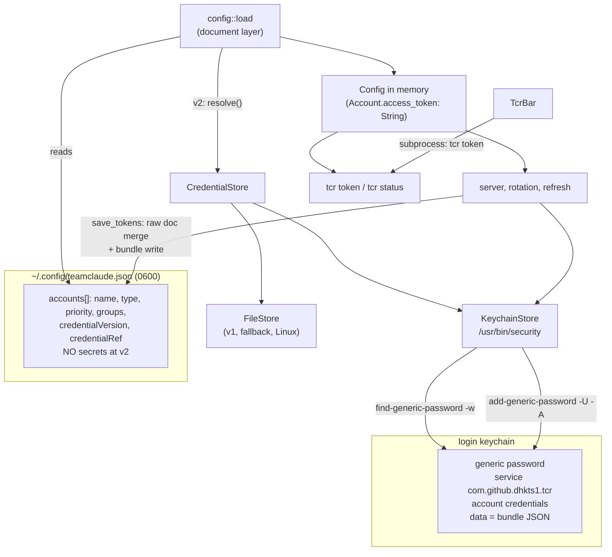

# Credential store: getting real OAuth tokens out of the plain-text config

Design for A13 (version-tag the credential envelope) and A14 (move the secrets into the OS
keystore) as one stacked change. Written against `d3911a9`, 2026-09-12, from the tree and from
first-party sources read the same night: the macOS SDK headers under
`/Applications/Xcode.app/.../MacOSX.sdk/System/Library/Frameworks/Security.framework/Headers`,
`man security`, and the crates.io API. Nothing here was built or run; the box was at seven times
its core count.

Every `file:line` below is a line I opened.

---

## 1. What is already true tonight

### A13 has shipped. This design starts from phase 0.5, not phase 0.

The credential envelope already carries a version, and it landed in `da38918`
("fix: six audit findings, batched for one version bump (#213)"), before this base commit:

- `src/config.rs:1133` `const CREDENTIAL_VERSION: u64 = 1;` with a doc-comment that names this
  exact future: "The credential-envelope version a later move to the OS keystore will need to tell
  an old plaintext shape from a new one."
- `src/config.rs:1147` `credential_version_of` reads `credentialVersion` off the raw JSON before
  serde sees it: absent is `Ok(None)`, a number is `Ok(Some(v))`, anything else is `Err(())`.
- `src/config.rs:1293-1330` runs that check inside `load` ahead of every other account read,
  backfills an absent key to `1` in the document, and refuses the whole file on a version this
  build does not understand, naming the account and the version in the error.
- Four unit tests cover it: `src/config.rs:3422` (missing backfills on save), `:3456` (explicit v1
  round-trips), `:3484` (unknown future version refuses), `:3508` (non-numeric refuses).

So the brief's phase-0 description ("add the version discriminant, read v1 and v2 both, fail loud
on unknown") describes work that exists. Proposing it again would be re-building a shipped feature.

### The one real gap left in A13: no writer stamps the key

The live config has 18 accounts and not one `credentialVersion` key:

```
jq '.accounts | length' ~/.config/teamclaude.json                                   # 18
jq -r '[.accounts[] | keys] | add | unique | join(",")' ~/.config/teamclaude.json
# accessToken,accountUuid,disabled,expiresAt,groups,name,orgName,orgUuid,
# organizationType,priority,rateLimitTier,refreshToken,seatTier,type
```

That is not a bug in the version check; it is the consequence of which writer actually runs. Only
a whole-`Config` `save` (`src/config.rs:1588`) carries the key out, and it does so indirectly,
through the `Account.extra` flattened map that `load` planted it in. The two writers that run in
the steady state never touch it:

- `save_tokens` (`src/config.rs:1797`) merges only a three-field `Credentials` struct
  (`accessToken` / `refreshToken` / `expiresAt`) into the raw on-disk document, by design.
- `save_account` (`src/config.rs:3183`), the durable half of `tcr login`, writes an `Account`
  built as a literal in `src/oauth.rs:1650-1672` with `extra: serde_json::Map::new()`.

Result: a fleet that has never taken a whole-file `save` since #213 is still, on disk,
indistinguishable from a pre-#213 fleet. A v2 rollout cannot tell "this entry was written by a
build that understands versions" from "this entry predates them". Closing that is the first
shippable slice of this design, and it is small.

### The write paths, and the contract each one keeps

| Path | `src/config.rs` | What it promises |
|---|---|---|
| `save` | `:1588` | whole snapshot, pretty JSON, only safe when the snapshot is fresh |
| `write_atomic` | `:1597` | same-directory temp, `O_EXCL`, `0600`, `sync_all`, rename; one implementation for every writer |
| `save_tokens` | `:1797` | read-modify-write of the RAW document; the file is the authority for everything except the three credential fields |
| `save_account` | `:3183` | insert-or-replace exactly one `accounts[]` entry by identity; refuses on an ambiguous match |

`save_tokens`' 40-line doc-comment (`src/config.rs:1760-1796`) names three shipped defects it
exists to prevent: a whole-file write reverting live user edits (observed 2026-07-25, a deleted
`pacing` key restored three restarts running), a silent skip that still returned `Ok(())`, and a
`Config` round-trip that would materialise serde defaults into the file. The last of those is the
load-bearing one for this design: **the merge runs on the raw JSON document so the file stays
byte-identical apart from credential fields.** Any v2 work keeps that property or it is wrong.

### Five landmines in the current load path

1. **`unusable_account` quarantines any entry with no non-empty `accessToken`**
   (`src/config.rs:1156-1178`), and when every account is quarantined, `load` fails the whole file
   ("no usable accounts remain", `src/config.rs:1350-1360`). A v2 file, whose entries carry no
   `accessToken` at all, hits this on the first boot after migration and takes the whole fleet
   down. This must change in the same commit that stops writing the field.
2. **`Account::access_token` is a required `String`** (`src/config.rs:187`) with no
   `#[serde(default)]`, deliberately: "an empty-string token must never reach rotation and send
   `Bearer ` upstream", and the doc-comment says the call sites reading it as a plain `String` are
   entitled to assume it. `rg -c access_token src` sums to 184 mentions. Changing that type is the
   expensive move; injecting the secret into the document before typed deserialisation is the
   cheap one.
3. **Account names are rewritten by the loader.** `migrate_duplicate_names`
   (`src/config.rs:1385`) renames duplicated accounts in memory and on disk, once, without
   refusing. Any keystore keyed one-item-per-account-name inherits an orphaned item every time
   that fires.
4. **The version check is a downgrade wall.** `src/config.rs:1311` refuses the whole file when it
   sees a version above what the build understands. After a v2 migration, every older `tcr` and
   every older TcrBar-bundled `tcr` fails to load the config at all. That is correct behaviour and
   it is also the rollback constraint: rollback is restoring a v1 file, never downgrading the
   binary alone.
5. **A second reader exists outside this repo.** `~/git/teamclaude/src/config.js` reads
   the same path, and `src/account-manager.js:63` does `credential: acct.accessToken || acct.apiKey`.
   A v2 file gives it `undefined`. Whether that reader is still in service is Gil's call, not a
   code question, but the migration must not discover it by accident.

### Who reads a credential today

- The server: from its boot-time `Config` in memory, per request.
- `tcr token <query>` (`src/cli.rs:348`): loads the file, prints one token to stdout, logs nothing.
- TcrBar: never opens the config. `apps/macos/Sources/TcrBarCore/TokenCommand.swift:1-12` says so
  in as many words, and shells out to `tcr token` for the row's "Copy Access Token" action.
- `tcr status --json` carries no token; the wire type is `crates/tcr-status-wire`.

One narrow check: `rg 'fn redact|\[REDACTED\]' src` finds nothing (positive control:
`rg -c 'fn ' src/config.rs` returns 202), and the refresh path's tracing lines carry no token
value. There is no redaction helper because nothing currently logs a secret.

### Build and dependency constraints

- `Cargo.toml:1-8` is explicit: CI runs `cargo test --all` and `cargo clippy --all-targets
  --locked` **on ubuntu**, so anything in `[dependencies]` compiles on Linux. There are no
  `[target.'cfg(...)'.dependencies]` sections in the file today.
- No `rust-version` key, no `rust-toolchain.toml`; `.github/workflows/ci.yml:31` uses
  `dtolnay/rust-toolchain@stable`. There is no MSRV to violate, and also none to hide behind.
- `Cargo.lock` holds 360 packages. `core-foundation-sys 0.8.7`, `bitflags 2.13.1` and
  `libc 0.2.189` are already there; `security-framework`, `core-foundation` and `keyring` are not.

---

## 2. The traps, named before the options

**Trap 1: this binary's code identity is not stable, and it is not even one identity.** Measured
tonight with `codesign -d -r-`:

```
/usr/bin/security                       identifier "com.apple.security" and anchor apple
/Applications/TcrBar.app/Contents/MacOS/tcr
                                        identifier tcr and anchor apple generic and ...
                                        certificate leaf[subject.OU] = <developer id team>
target/debug/tcr                        cdhash H"eedbd4a1026b6bf47055cddd461f732e6a13b7e9"
target/release/tcr                      cdhash H"558bf5b73ea589151dab3bf303d97dbadc38be85"
```

`~/.local/bin/tcr` is a symlink to the bundle binary (`ls -l`), so today's shell `tcr` and the
supervised server are the same signed image. A cargo build is not: it is ad-hoc signed, its
designated requirement is a bare `cdhash`, and the two builds above already differ. `build-tcrbar.sh:404`
signs the bundled `tcr` with a Developer ID (ad-hoc if no certificate is present, `:446`), while
`scripts/install-cli.sh:208` only *verifies* a signature and never adds one. So a keychain ACL
pinned to "the app that created this item" grants access to one of these and refuses the next
build of the other.

**Trap 2: the partition list is a second ACL that needs the keychain password to change.**
`man security`, `set-generic-password-partition-list`: *"The 'partition list' is an extra parameter
in the ACL which limits access to the item based on an application's code signature. You must
present the keychain's password to change a partition list."* This is the mechanism behind every
CI story about `set-key-partition-list`. It means the cheap fix for trap 1 ("just add the new
binary to the trusted list") is not cheap: it is an interactive password prompt on every rebuild.

**Trap 3: a prompt in a headless process is a hang, and the honest alternative is an error.**
`SecBase.h:286` and `:361`: `errSecInteractionNotAllowed = -25308, /* User interaction is not
allowed. */`. `SecKeychain.h:634-641` still declares `SecKeychainSetUserInteractionAllowed(Boolean)`,
deprecated since macOS 10.10 along with the rest of `SecKeychain`, which turns a would-be prompt
into that error. Two separate headless cases matter here: a launchd-started server with no GUI
session, and an ssh session on this box, where the login keychain may be locked outright. Neither
may be allowed to block a boot.

**Trap 4: per-account keying drifts.** See landmine 3: the loader renames accounts.

**Trap 5: the downgrade wall.** See landmine 4.

**Trap 6: the `-A` escape hatch is real but it is a choice, not a default.** `man security`,
`add-generic-password`: *"-A Allow any application to access this item without warning (insecure,
not recommended!)"* and *"By default, the application which creates an item is trusted to access
its data without warning."* Taking `-A` says out loud that the boundary being bought is the FILE,
not process isolation on this machine.

---

## 3. Approaches considered

All four assume one thing that is not negotiable: the secrets stay reachable by the server at boot
without a human present.

### A. `keyring` crate, one item per account

Read from crates.io tonight: `keyring` 4.2.0, MIT OR Apache-2.0, MSRV 1.88.0, ~10.4M recent
downloads. Its only unconditional dependency is `keyring-core ^1`; the Apple backend is
`apple-native-keyring-store ^1` behind `cfg(any(target_os = "macos", target_os = "ios"))`, which
itself depends on `security-framework ^3.7`, `keyring-core` and `log`. Net new packages:
about five. The crate documents two Apple stores, a "legacy keychain" available to all
applications and a protected data store "available to sandboxed applications in macOS 10.15 or
later", with some features "only available to applications with provisioning profiles". The
protected store is not available to us: `SecItem.h:201-205` says access groups "are determined by
two entitlements for that application", and an ad-hoc-signed cargo binary has no team to be in.

So this lands on the legacy keychain with the crate's default ACL, which is trap 1 and trap 2 at
full strength, one item per account (trap 4), and an error surface that hides the OSStatus you
need to tell "locked" from "denied" from "absent".

### B. `security-framework` in process, one bundle item

Read tonight: `security-framework` 3.7.0, MIT OR Apache-2.0, MSRV 1.85, deps `bitflags ^2.11`,
`core-foundation ^0.10`, `core-foundation-sys ^0.8.6`, `libc ^0.2.139`, `security-framework-sys
^2.17`, optional `log`. Three of those are already in `Cargo.lock`, so this is about three new
packages, and it must sit under `[target.'cfg(target_os = "macos")'.dependencies]` or the ubuntu
CI job stops compiling.

Typed errors, fast reads, no subprocess. But the module that would be used
(`security_framework::passwords`) exposes no way to create an item with a permissive ACL: the
documented access type there is `AccessControlOptions` for `SecAccessControl`, which is the
biometric/protected-item mechanism, not the legacy trusted-application list. So the item still has
to be CREATED by something else to dodge traps 1 and 2, and once creation is a subprocess the
in-process read is buying only milliseconds on a once-per-boot path.

### C. One bundle item, `/usr/bin/security` for every touch **(chosen)**

Zero new dependencies. One keychain item for the whole fleet, created and read by the single
Apple-signed binary whose designated requirement is stable across every tcr build:
`identifier "com.apple.security" and anchor apple`. Creation takes `-A -U`, so the trusted
application list is not the gate and the partition list is never something we have to rewrite. A
`CredentialStore` trait keeps the subprocess behind one seam, so a later in-process implementation
is a drop-in that no caller sees, and the file implementation keeps compiling on Linux CI.

Costs, stated plainly: one process spawn per bundle read (once per boot, once per `tcr token`, once
per credential write), output parsing instead of typed errors, and an open question about whether
the write feeds the secret on stdin through `security -i`, never in argv (section 9, phase 2 gate; probed 2026-09-12).

### D. Envelope encryption: one key in the keychain, ciphertext in the file

`ring` is already in the tree (rustls uses it) and exposes AEAD, so this adds no package at all.
The file keeps its shape; the three credential fields become one ciphertext string; the key is one
keychain item. This preserves `save_tokens`' raw-document merge with almost no thought, survives
the rename migration, and needs exactly one keychain touch per process.

It loses on one axis that matters: the file still carries the secret material, so "the config file
is not a credential bearer" stops being literally true, and every future reviewer has to re-derive
that the nonce discipline is right. It is a format we would own forever.

### Scoring

| Axis | A keyring | B security-framework | **C security(1)** | D envelope |
|---|---|---|---|---|
| New packages | ~5 | ~3 (macOS-only) | **0** | 0 |
| Survives a rebuilt, unsigned `tcr` | no (trap 1) | no at create | **yes** | yes |
| Partition-list exposure | yes | yes | **no, `-A` at create** | one item only |
| Headless behaviour | opaque error | typed OSStatus | **exit code plus stderr** | same as C |
| Items to keep in sync with 18 accounts | 18 | 1 | **1** | 1 |
| Survives `migrate_duplicate_names` | no | yes | **yes** | yes |
| Blast radius in `config.rs` | doc layer | doc layer | **doc layer** | doc layer |
| Linux CI stays green | needs cfg | needs cfg | **unchanged** | unchanged |
| "No secret in the file" literally true | yes | yes | **yes** | no |
| Rollback | re-write v1 | re-write v1 | **re-write v1** | decrypt in place |

## 4. Decision

**Take C.** One generic-password item holds the whole fleet's secrets as JSON; the config file
carries a version and a reference; every keychain touch goes through `/usr/bin/security`, behind a
`CredentialStore` trait whose file implementation is the fallback, the Linux implementation, and
the thing every existing test keeps exercising.

The reason C wins is not elegance, it is trap 1. The other approaches all assume a stable code
identity for this binary, and the measurements above say there is no such thing here: a
Developer-ID-signed bundled `tcr`, a symlinked shell `tcr`, and cargo builds whose designated
requirement is a fresh `cdhash` every time. Routing every touch through the one Apple-signed tool
makes the identity question disappear instead of managing it.

**How sure: shown, level 3.** The structural facts are measured (the two `cdhash` values, the
symlink, the signing in `build-tcrbar.sh:404`), and the ACL and partition-list semantics are quoted
from `man security` on this machine. What is not measured is the runtime behaviour of the chosen
path: no keychain item was created tonight, so "`-A` at create means a later in-process read never
prompts" is read from documentation, not observed. Phase 2's gate is exactly that observation.

**The alternative that stays plausible: D.** If the phase-2 probe shows that `security` cannot take
the secret on stdin, or that a launchd-started server hits the partition list anyway, D closes the
same four threats with one keychain touch and no subprocess, at the price of owning a format. Do
not start D until C's probe has actually failed.

---

## 5. User stories

1. As the operator, I want my OAuth tokens off the plain text of a file I hand-edit, so that a
   screenshare, a Time Machine backup or a stray `cat` does not disclose 18 live accounts.
2. As the operator, I want a `tcr` upgrade to migrate my config without me doing anything, so that
   the move costs me no logins. (The 29-day refresh-token wall in
   `docs/design/long-lived-tokens.md` is what makes a forced re-login expensive.)
3. As the operator, I want the proxy to boot with no prompt and no hang when nobody is at the
   screen, so that a restart under launchd or over ssh is still just a restart.
4. As the operator, I want a migration I can undo, so that a bad release costs me one command and
   not my fleet.
5. As a `tcr` contributor, I want the credential store behind one trait with a file implementation,
   so that the whole test suite still runs on a Linux CI box with no keychain.
6. As a future reader of the config, I want each account entry to say which credential shape it is
   in, so that a build that does not understand it refuses loudly instead of guessing.

## 6. Out of scope

- Encrypting or protecting `~/.cache/teamclaude/session-affinity.json` or the log directory.
- Anything about the API key in `proxy.apiKey` (`src/config.rs` `ProxyConfig`). It is a different
  secret with a different threat model; the same store can take it later.
- Any change to how tokens are held in memory, passed upstream, or refreshed.
- Any change to `Account`'s typed shape or to the 184 `access_token` call sites.
- Touch ID, biometric gating, or per-read authorisation.
- Linux and Windows keystores (see phase 4; the honest answer is "later or never").
- Fixing the JS `teamclaude` reader. The migration must NOTICE it, not repair it.
- Adding a redaction helper. Nothing logs a secret today; that is a separate audit.

---

## 7. Target structure

```
src/
  config.rs          # unchanged contracts; gains a document-layer resolve step and a scrub step
  credstore/
    mod.rs           # Credential, CredentialRef, Bundle, Secrets, CredentialStore, StoreError
    file.rs          # FileStore: v1 behaviour, the fallback, and the Linux implementation
    keychain.rs      # KeychainStore: /usr/bin/security, macOS only at runtime, compiles everywhere
tests/
  fixtures/legacy_configs/
    v0_2_48_credential_v1.json     # explicit v1, added in phase 0
    v0_2_5x_credential_v2.json     # reference-only entry, added in phase 3
  credential_store_roundtrip.rs    # trait-level tests with a stub store
```

Boundary contracts:

- **`config::load` to `credstore`**: `load` resolves a v2 entry by asking the store for the bundle
  and injecting `accessToken` / `refreshToken` / `expiresAt` back into the raw JSON *document*
  before `serde_json::from_value` runs. This is the same layer that already migrates the legacy
  `throttle` key (`src/config.rs:1234-1290`) and already edits the document for
  `credentialVersion` (`:1293-1330`). Nothing downstream of `from_value` learns that the store
  exists, so `Account::access_token` stays a required `String` and the 184 call sites stay put.
- **`config::save*` to `credstore`**: the reverse. Before writing, a v2 document has its three
  credential fields removed and the bundle handed to the store. `write_atomic` is untouched.
- **`credstore` to the OS**: one generic password item, `service = com.github.dhkts1.tcr`,
  `account = credentials`, data = the bundle JSON below. The store never prompts, never blocks
  longer than its timeout, and classifies every failure.
- **Bundle key rule**: the key inside the bundle is the account's `name` field, derived at write
  time, never stored in the reference. Duplicate-name renames (`src/config.rs:1385`) therefore
  heal on the next write, because the bundle is written whole.

On-disk v2 account entry:

```json
{
  "name": "alice@example.com/acme-corp",
  "type": "oauth",
  "credentialVersion": 2,
  "credentialRef": "keychain:com.github.dhkts1.tcr/credentials",
  "priority": 0,
  "groups": ["work"]
}
```

Bundle stored in the keychain item:

```json
{
  "v": 2,
  "accounts": {
    "alice@example.com/acme-corp": {
      "accessToken": "...",
      "refreshToken": "...",
      "expiresAt": 1789000000000
    },
    "bob@example.com/acme-corp": {
      "accessToken": "...",
      "expiresAt": 1789000000000
    }
  }
}
```

The second entry is the `claude setup-token` case: no `refreshToken` key at all, because
`src/oauth.rs:30-45` says `None` there means "there is nothing to store", not "it was lost".



## 8. Sketch

Types and signatures are real; bodies are stubs.

```rust
// src/credstore/mod.rs

/// Where one account's OAuth secrets live at rest.
///
/// The variant is decided by the entry's `credentialVersion`
/// (`crate::config::CREDENTIAL_VERSION`), read at the document layer before
/// serde ever sees the entry.
#[derive(Debug, Clone, PartialEq, Eq)]
pub enum Credential {
    /// v1: the secrets are inline in the config file, in plain text.
    Plain(Secrets),
    /// v2: the config file carries only this reference.
    Stored(CredentialRef),
}

/// The `credentialRef` string, parsed. `keychain:<service>/<item>` today;
/// `file:` exists so the v1 path has a name, not because anyone writes it.
#[derive(Debug, Clone, PartialEq, Eq)]
pub struct CredentialRef {
    pub kind: StoreKind,
    pub service: String,
    pub item: String,
}

#[derive(Debug, Clone, Copy, PartialEq, Eq)]
pub enum StoreKind { File, Keychain }

/// One account's secrets. `refresh_token` is `None` ONLY for a
/// `claude setup-token` credential; see `crate::oauth::Tokens`'s doc-comment
/// (src/oauth.rs:30) before changing that to a required field.
#[derive(Debug, Clone, PartialEq, Eq, serde::Serialize, serde::Deserialize)]
#[serde(rename_all = "camelCase")]
pub struct Secrets {
    pub access_token: String,
    #[serde(default, skip_serializing_if = "Option::is_none")]
    pub refresh_token: Option<String>,
    #[serde(default, skip_serializing_if = "Option::is_none")]
    pub expires_at: Option<i64>,
}

/// The whole fleet's secrets, keyed by `Account::name`. Written whole, which
/// is what makes `config::migrate_duplicate_names` (src/config.rs:1385) safe:
/// a rename drops the stale key on the next write instead of orphaning an item.
#[derive(Debug, Clone, Default, serde::Serialize, serde::Deserialize)]
pub struct Bundle {
    pub v: u64,
    pub accounts: std::collections::BTreeMap<String, Secrets>,
}

/// Why a store touch failed. Every variant is a different operator action, which
/// is the whole reason this is not one opaque error.
#[derive(Debug, thiserror::Error)]
pub enum StoreError {
    /// No item yet. Not an error on first migration; fatal afterwards.
    #[error("no credential item at {0}")]
    Absent(String),
    /// The keychain is locked and nobody can be asked (ssh, no GUI session).
    /// OSStatus -25308, errSecInteractionNotAllowed (SecBase.h:361).
    #[error("the login keychain is locked; run `security unlock-keychain` and retry")]
    Locked,
    /// The item exists and access was refused: ACL or partition list.
    #[error("access to {0} was refused by the keychain")]
    Denied(String),
    /// The tool did not answer inside the deadline. Never a hang.
    #[error("`{tool}` did not answer within {timeout_ms}ms")]
    Timeout { tool: String, timeout_ms: u64 },
    #[error("credential bundle is not readable JSON: {0}")]
    Malformed(String),
    #[error(transparent)]
    Io(#[from] std::io::Error),
}

pub trait CredentialStore: Send + Sync {
    /// Read the whole bundle. Never prompts, never blocks past its deadline.
    fn load_bundle(&self) -> Result<Bundle, StoreError>;

    /// Write the whole bundle, creating the item if needed.
    fn save_bundle(&self, bundle: &Bundle) -> Result<(), StoreError>;

    /// Can this store be used right now, without asking a human anything?
    /// Called before a migration commits, never on the hot path.
    fn probe(&self) -> Result<(), StoreError>;
}

/// v1 behaviour and the Linux implementation: the bundle is the config file.
pub struct FileStore { pub path: std::path::PathBuf }

/// macOS: one generic password item, every touch through `/usr/bin/security`.
///
/// `/usr/bin/security` is the ONLY caller identity in this design, on purpose.
/// Measured 2026-09-12: its designated requirement is
/// `identifier "com.apple.security" and anchor apple`, stable across every tcr
/// build, while a cargo-built `tcr` is ad-hoc signed with a fresh cdhash each
/// time (`codesign -d -r- target/release/tcr`).
pub struct KeychainStore {
    pub tool: std::path::PathBuf,   // /usr/bin/security, overridable in tests
    pub service: String,            // com.github.dhkts1.tcr
    pub item: String,               // credentials
    pub timeout: std::time::Duration,
}

impl CredentialStore for KeychainStore {
    fn load_bundle(&self) -> Result<Bundle, StoreError> {
        // security find-generic-password -s <service> -a <item> -w
        // exit 44 => Absent (measured 2026-09-12 against a service name that
        // does not exist: exit 44, stderr "SecKeychainSearchCopyNext: The
        // specified item could not be found in the keychain.")
        // stderr naming -25308 => Locked; no answer in time => Timeout
        todo!()
    }
    fn save_bundle(&self, _bundle: &Bundle) -> Result<(), StoreError> {
        // printf 'add-generic-password -U -A -s <service> -a <item> -w <secret>\n' | security -i
        // the command, secret included, on stdin; a bare -w prompts and stores EMPTY (probed 2026-09-12)
        todo!()
    }
    fn probe(&self) -> Result<(), StoreError> { todo!() }
}
```

The one test that must exist before any of it is wired up:

```rust
// tests/credential_store_roundtrip.rs

/// A `claude setup-token` account has no refresh token, and that is a fact to
/// preserve, not a gap to fill. `src/oauth.rs:30-45`: `None` there means the
/// producing CLI never surfaced one. A round trip that invents an empty string
/// would put `Bearer ` on the wire at the next refresh attempt.
#[test]
fn setup_token_account_round_trips_without_a_refresh_token() {
    let mut bundle = Bundle { v: 2, accounts: Default::default() };
    bundle.accounts.insert(
        "alice@example.com/acme-corp".to_string(),
        Secrets { access_token: "at-a".into(), refresh_token: None, expires_at: Some(7) },
    );

    let store = StubStore::default();
    store.save_bundle(&bundle).unwrap();
    let read_back = store.load_bundle().unwrap();

    let got = &read_back.accounts["alice@example.com/acme-corp"];
    assert_eq!(got.access_token, "at-a");
    assert_eq!(got.refresh_token, None, "a setup-token account must not gain a refresh token");
    assert_eq!(got.expires_at, Some(7));

    let json = serde_json::to_string(&bundle).unwrap();
    assert!(!json.contains("refreshToken"), "an absent refresh token must not serialise at all");
}
```

---

## 9. Phased migration

Every phase ships on its own and leaves the gates green. Line deltas are estimates.

### Phase 0: writers stamp the version they write (finishes A13)

- **Files**: `src/config.rs` (`merge_tokens`' `Credentials` struct and its insert site near `:1860`;
  `merge_account` near `:3196`), `tests/fixtures/legacy_configs/v0_2_48_credential_v1.json` (new).
- **Delta**: about +40 / -5 in `src/config.rs`, plus one fixture and two tests.
- **Change**: any entry a writer touches gets `credentialVersion: 1` written explicitly if it has
  no version key. Nothing else about the merge changes.
- **Gate**: `cargo test --locked config::tests::` plus `cargo test --locked --test
  legacy_config_shapes`.
- **The failure the gate must catch** (write the test first, watch it fail): after `save_tokens`
  on a file whose entry has no version key, the entry still has no version key. Second failure to
  catch: `save_tokens` changed any byte other than the credential fields and the version key, so
  assert an unrelated top-level key (`pacing`) and an unrelated account key (`switchThreshold`)
  survive untouched.
- **Rollback**: revert. A v1 stamp is a no-op for every reader.

### Phase 1: the trait and the file store, no behaviour change

- **Files**: `src/credstore/mod.rs`, `src/credstore/file.rs` (new), `src/lib.rs` (one `mod` line),
  `tests/credential_store_roundtrip.rs` (new).
- **Delta**: about +320 new, about +30 in `src/config.rs` to route v1 reads and writes through
  `FileStore`.
- **Gate**: the full suite, `cargo test --locked --all`. Plus a golden test: load and save a
  fixture config, assert the bytes are identical to the input apart from the version key.
- **The failure the gate must catch**: routing through the trait re-materialises a serde default
  into the file, which is the exact defect `save_tokens`' doc-comment at `src/config.rs:1787-1796`
  says the raw-document merge exists to prevent.
- **Rollback**: revert. Nothing on disk changed.

### Phase 2: the keychain store exists, opt-in, write-through, file still authoritative

- **Files**: `src/credstore/keychain.rs` (new), `src/config.rs` (a `credentialStore` config key,
  default `"file"`), `docs/configuration.md`.
- **Delta**: about +260 new, about +25 elsewhere.
- **Change**: with `"credentialStore": "keychain"` set, every credential write goes to the file AND
  the keychain. Reads still come from the file. No entry is stamped v2 yet.
- **Gate, mechanical**: `cargo test --locked --all` with a stub tool binary in place of
  `/usr/bin/security`, covering: absent item, locked keychain, timeout, malformed bundle,
  setup-token round trip.
- **Gate, on the real machine.** Probe 1 was run by the lead on 2026-09-12 (`security` on
  macOS 25.6): `printf '%s' secret | security add-generic-password ... -w` does NOT read stdin.
  A bare `-w` prompts on the tty, the piped bytes make the two prompts mismatch, and the item
  is created with an EMPTY password (exit 0, `find-generic-password -w` prints nothing). The
  working form is the interactive mode, where the whole command arrives on stdin and the secret
  never enters argv:
  ```
  # 1. write: the command line, secret included, goes to security's stdin (verified, exit 0)
  printf 'add-generic-password -U -A -s tcr-probe -a credentials -w %s\n' "$secret" | security -i
  # 2. read back from a plain shell (verified: prints the value, exit 0)
  security find-generic-password -s tcr-probe -a credentials -w
  # 3. still unverified: from a process with no GUI session
  ssh localhost 'security find-generic-password -s tcr-probe -a credentials -w'
  # 4. still unverified: from the supervised server's context, however it is started
  # 5. clean up (verified, exit 0)
  security delete-generic-password -s tcr-probe -a credentials
  ```
  `-i` reads one command per line, so a secret containing a newline must be rejected before the
  write (OAuth tokens are base64url and cannot). If (3) returns `-25308` or hangs, phase 3 does
  not ship without an unlock story.
- **The failure the gate must catch**: a keychain write that silently succeeds while the read path
  gets a different item, or a prompt appearing in a context with no human. Watch the prompt fire
  once on purpose (create an item WITHOUT `-A` from one binary and read it from another) so the
  test proves the `-A` path is what suppressed it, rather than proving nothing.
- **Rollback**: set the key back to `"file"`. The file never stopped being authoritative.

### Phase 3: flip to v2, the file stops carrying secrets

- **Files**: `src/config.rs` (`unusable_account` at `:1156`, the all-quarantined error at `:1350`,
  the document-layer resolve and scrub, `CREDENTIAL_VERSION` to 2), `src/cli.rs:348`
  (`print_access_token` reads through the store), `tests/fixtures/legacy_configs/` (a v2 fixture),
  `docs/configuration.md`, `README.md`.
- **Delta**: about +200 / -40.
- **Migration on first boot, in this order**:
  1. Read the v1 file. If the store already holds a bundle that disagrees, stop and say so.
  2. Write the bundle. Read it back through a fresh store instance. If the read-back does not match
     byte for byte, stop, change nothing, log the reason.
  3. Copy the file to `~/.config/teamclaude.json.v1-backup` with mode 0600, via `write_atomic`.
  4. Write the v2 document: credential fields removed, `credentialVersion: 2` and `credentialRef`
     added per entry.
  5. Log one line naming the backup path, the item, and the account count.
- **The failure the gate must catch**: an entry with no `accessToken` being quarantined by
  `unusable_account` and taking the whole fleet down with "no usable accounts remain"
  (`src/config.rs:1350-1360`). Write that test against a v2 fixture BEFORE changing the check, and
  watch it fail with exactly that message.
- **Second failure to catch**: step 2 passing because it compared the bundle to itself in memory
  rather than to what came back out of the store.
- **Rollback**: `cp ~/.config/teamclaude.json.v1-backup ~/.config/teamclaude.json`. Note the
  downgrade wall at `src/config.rs:1311`: an older binary refuses a v2 file outright, so a binary
  downgrade WITHOUT restoring the backup is a dead fleet, not a partial one. Say this in the
  release notes.
- **Before this phase ships**, answer the JS reader question (`~/git/teamclaude/src/config.js`,
  `src/account-manager.js:63`). It is a decision, not a code change.

### Phase 4: Linux, honestly

tcr is macOS-first: the menubar app, the Sparkle updater, the `security` tool, the
`codesign` install check. Linux runs the CI job and nothing else that anyone uses. So Linux gets
`FileStore` at 0600, which is what it has today, and the trait means that is a complete
implementation rather than a hole. A Secret Service backend is a phase 4 that should not be built
until somebody actually runs the proxy on Linux. If that day comes, `keyring`'s
`zbus-secret-service-keyring-store` is the obvious candidate and it changes one file.

---

## 10. What this does not fix

The threat closed is the file, and only the file:

- **Closed**: the token leaving the machine inside a Time Machine or cloud backup; the token being
  read out of a config file copied somewhere careless; the token appearing on screen during a
  screenshare or a `cat`; the token being committed by accident (the pre-commit `gitleaks` hook
  stays the backstop, not the plan); another user on the box reading the file if the 0600 mode were
  ever lost.
- **Not closed**: the token is still in the server's memory for its whole life, and in every
  request it sends. A debugger attached to the process reads it. Root reads it. Any process running
  as this user that can execute `/usr/bin/security` reads it, because that is exactly what `-A`
  means; the item is protected by the login keychain being locked, not by process identity. The
  token still travels to the API, and `tcr token` still prints it to stdout by design.
- **Not changed**: the 29-day absolute refresh-token clock and the one-year access token
  (`docs/design/long-lived-tokens.md`). A stolen access token stays valid until it expires, and
  with a one-year lifetime that is a long time. Revocation is an Anthropic-side action this design
  does not touch.

If the goal were process isolation rather than file hygiene, none of these approaches deliver it
and the design would have to start from a broker process with its own identity. That is a
different project and it should be named as one.

---

## 11. Do not

- **Do not re-implement A13.** `credentialVersion` shipped in `da38918`. Phase 0 is a stamping
  gap, not a feature.
- **Do not change `Account::access_token` to an `Option`.** 184 mentions, and
  `src/config.rs:1190-1198` explains why a missing token must never become an empty string. Resolve
  at the document layer instead.
- **Do not put one keychain item per account.** `migrate_duplicate_names` (`src/config.rs:1385`)
  renames accounts under you.
- **Do not let `save_tokens` become a `Config` round-trip.** Its doc-comment at
  `src/config.rs:1787-1796` names the live incident that produced the rule.
- **Do not add a macOS-only crate to `[dependencies]`.** `Cargo.toml:1-8` says the ubuntu CI job
  compiles everything listed there.
- **Do not ship a code path that can prompt.** A prompt in the server is a hang. Disallow
  interaction and turn it into `StoreError::Locked` with the unlock command in the message.
- **Do not delete the plaintext until a read-back through a fresh store instance has matched.**
- **Do not restart the running proxy to test any of this.** `CLAUDE.md` and the affinity TTL
  (`affinity::PIN_TTL_MS`, 15 minutes) both say what a restart costs.
- **Do not build the Linux keystore, the API-key move, or a broker process in this stack.** They
  are each a separate decision with a separate owner.
