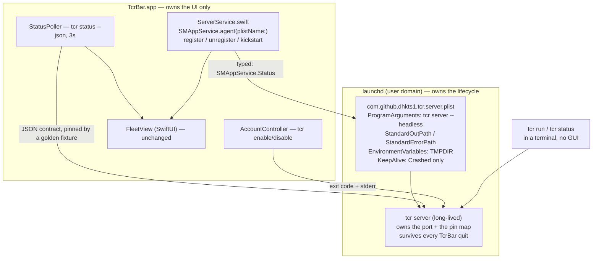

# Target state for the TcrBar ↔ tcr boundary

Design study, 2026-08-08. Read-only survey; no source edited.

**Question asked:** should the tcr proxy become an in-process library that TcrBar links
(swift-bridge staticlib), instead of a child process it spawns?

**Answer:** no — not as the next move, and not as the destination either. The
recommendation is Approach C: **hand the proxy's lifecycle to `launchd` via
`SMAppService.agent`, and delete TcrBar's supervision code entirely.** It deletes the
same five defects the FFI would delete, at roughly a tenth of the cost, with no new
dependency and no Rust change — and it *preserves* a property the FFI would destroy
permanently: the proxy outliving the GUI.

> **This file is committable to a public repo.** `docs/plans/` is gitignored
> (`.gitignore:39`); `docs/design/` is not. Nothing below contains account data,
> UUIDs or credentials. It also contains no source lifted from the private sibling
> repo referenced in §1 — only observations about it and the public swift-bridge API.

---

## 1. Prior art: what `/Users/gil/git/tikkun` actually teaches

Mined first, as instructed. An inventory of that repo already exists locally at
`docs/plans/tikkun-macos-inventory.md` (gitignored); this section adds what that
inventory did not answer, and corrects one thing it implies.

**IP constraint, stated up front.** `docs/plans/tcrbar-bridge-coder.md:16-19` records
that tikkun is a private repo in a different org with no LICENSE file, and that copying
it into this public MIT repo is an IP violation. That constraint still holds. The
swift-bridge *mechanism* is the crate's own public API and carries no such problem;
tikkun's Swift, tokens and build scripts do.

### Why swift-bridge rather than uniffi / cbindgen / hand-rolled C?

**The reason is not recorded anywhere. It is inferred.** Searched `README.md`,
`ARCHITECTURE.md`, `docs/ROADMAP.md`, `docs/research/prior-art.md`, `docs/probes/*`,
and the introducing commit `7b5f401 feat: M0-macOS swift-bridge FFI seam`. Every hit
describes *what* was built; none compares alternatives. `uniffi` and `cbindgen` appear
zero times in that repo. σ3 — the absence is asserted against a positive control
(`rg -l 'swift-bridge'` returns 10 files including scripts and workflows, so the probe
reaches the surfaces where a rationale would live).

Inheriting an unexamined choice is exactly the failure the brief warned about. The
choice is *defensible* — swift-bridge generates Swift directly, uniffi's Swift backend
wants a UDL/proc-macro layer and a runtime package — but it was never argued, so it
carries no evidentiary weight for tcr.

### What went wrong there — the scars worth knowing

**The deliberately tiny surface is the whole trick, and it is a confession.** The bridge
is four functions moving only `String`, `u8`, `bool`
(`crates/tikkun-ffi/src/lib.rs:27-42`), and the doc-comment states JSON is the boundary
encoding so swift-bridge only has to move `String`s (`:14-16`). That is not elegance —
it is a working admission that anything richer is not worth the risk.

**A stateful FFI session was considered and REJECTED.**
`docs/plans/lattice-v1-blueprint.md:242-246` rejects a swift-bridge opaque type with
`observe_edit`/`decode` methods, citing "cross-FFI lifetime + thread-safety concerns"
and a `catch_unwind` per method, at σ2. **This is the single most important finding for
tcr**, because a long-lived proxy handle is *precisely* the stateful opaque type that
was rejected. The one place the prior art is directly on-point, it says no.

**Nothing there owns a long-lived Rust thread or async runtime across the boundary.**
Every exported function is request/response and builds its state fresh
(`analyze` constructs a `Session` per call, `lib.rs:92-104`). The only long-lived object
is a `OnceLock<Session>` that is *initialised* across the boundary and then only read
(`lib.rs:184-225`) — no runtime, no threads the app must stop, no shutdown path. tcr
needs all three. **tikkun offers no evidence at all about the hard part.**

**Codegen staging is script-enforced, not build-system-enforced.** `build.rs` generates
into `OUT_DIR` then copies four files into the app tree, splitting `.swift` from `.h`
because SwiftPM forbids mixing them in one target. `Package.swift` links
`-L<workspace>/target/debug -ltikkun_ffi` via `.unsafeFlags`. SwiftPM has no idea cargo
must run first; ordering lives in a shell script. The inventory already flags the
consequence: the link path is hardcoded to `target/debug`, so a release Swift build
would link the debug archive (`tikkun-macos-inventory.md:512-513`). That is a latent
bug in the prior art, still unfixed.

**Link flags are hand-derived and go stale silently.** `Package.swift:56-68` names
`Security`, `CoreFoundation`, `Metal`, `Foundation`, `-lobjc`, `-liconv`, with a comment
saying they came from `rustc --print native-static-libs` on a dated run. A static `.a`
carries no transitive link directives, so **every dependency change can silently require
re-deriving that list**, and the failure is a link error with no pointer to its cause.
tcr's dependency set (rustls/ring, reqwest, rcgen — `Cargo.toml:14-64`) is far larger
than tikkun's.

**CI covers the link, weakly.** tikkun's `.github/workflows/ci.yml:46-68` has a
`macos-latest` job running `cargo test --workspace` then `swift build`. No `swift test`.
So the *link* is covered and the Swift *behaviour* is not.

### Was swift-bridge a mistake there?

**No — for what tikkun does.** Four pure functions moving strings across a boundary,
with `catch_unwind` on each, is the case swift-bridge is good at, and it has shipped.

**But it is weak evidence for tcr, and the one directly transferable judgement in that
repo is a rejection.** tcr's need is the opposite shape: one long-lived stateful object,
a multi-threaded async runtime, an orderly shutdown, and a lifetime that must *exceed*
the app's. Nothing in tikkun exercises any of that. Reusing swift-bridge here would not
be inheriting a proven pattern; it would be extending an unproven one into the exact
territory its own author declined to enter.

---

## 2. Patterns and contracts found in tcr

### The boundary as it exists

The app shells out to the CLI and speaks no HTTP, deliberately: the status endpoint
requires the proxy API key with no loopback exemption
(`src/proxy.rs:376,535-554`; rationale at `TcrTool.swift:4-9`), and a menu-bar app has
no business holding that secret. So there are **three distinct subprocess seams**, and
they are not equally bad:

| Seam | Swift side | Rust side | Health |
|---|---|---|---|
| **Lifecycle** — spawn/supervise/classify-exit | `ServerController.swift` (634 lines) | `run_server` + `singleton` + exit codes | **This is where all six defects lived.** |
| **Read** — `tcr status --json` every 3s | `StatusPoller.swift:59-61,112-124` | `cli::status` (`src/cli.rs:841`) | Sound. Typed both sides, ~10 Rust tests on `render_accounts_json`, ~44k of Swift decode tests. |
| **Write** — `tcr enable/disable <name>` | `AccountControl.swift:27-88` | `cli::set_enabled` (`src/cli.rs:202`) | Sound. Never optimistic; re-polls for truth (`:13-20`). |

`TcrTool.run` already reads both pipes to end *before* `waitUntilExit()` and says why
(`TcrTool.swift:119-132`) — the deadlock class is handled on the read/write seams. The
deadlock happened on the **lifecycle** seam, where the child is long-lived and nobody
drained stdout (`ServerController.swift:332-349`).

**That asymmetry is the load-bearing structural fact of this whole document.** The
process boundary is not uniformly defective. One of its three uses is, and it is the one
whose job an operating-system supervisor does better than either language.

### The contracts that cross with no compiler

- `INCUMBENT_MARKER = "another proxy holds"` — `src/singleton.rs:233`, read by
  `ServerController.incumbentMarkers` (`:401-407`). Pinned by a Rust test that spells the
  literal out rather than referencing the constant, deliberately
  (`src/singleton.rs:459-487`).
- Stand-down exit codes 3/4 — `src/main.rs:479-494`, mapped by
  `stand_down_exit_code` (`:504-517`), switched on by `ServerController.StandDownExit`
  (`:433-439`). Pinned on both sides as of commits `f1b9392` / `136f033`.
- Three argument vectors — `ServerController.swift:153,160,169` — one of which encodes
  "take the port" as the *absence* of a flag, for a legacy binary vintage.
- The clap flag conflict — `src/main.rs:198` `conflicts_with = "replace"`.
  **Live drift found:** `ServerController.swift:156-157` still claims "when both are
  passed `tcr` lets the safe one win (`src/main.rs:486`)", which is no longer true; the
  same file gets it right 300 lines later (`:450-456`). Two comments in one file, one
  stale, both describing a Rust default. σ3 — read both sides.
- `tcr status --json` key set — pinned by Rust tests on `render_accounts_json`
  (`src/cli.rs:1241,1269,1311,1330,1338,1402,1445,1775`) and by Swift decode tests.
  No single test asserts the *union* Swift requires. That gap is Phase 1 below.

### The property the current design exists to protect

`ServerController`'s type-level doc (`:4-26`) and `TcrBarApp.swift:41-49` both say it:
the proxy is a shared service, replacing it wipes the session→account pin map and
cold-starts every live session's prompt cache, and **the app deliberately never signals
a process it did not spawn**. `TcrBarApp.swift:44-45` names the cost of coupling
directly: "it also makes Quit expensive, because once TcrBar supervises the server,
quitting stops it."

A `tcr run` session in a terminal needs the proxy. It does not need TcrBar. **Binding the
proxy's lifetime to a menu-bar app's lifetime is a product regression, not an
implementation detail** — and that is the criterion that decides this document.

### Layering facts that constrain any option

- `src/lib.rs:8` — `#![forbid(unsafe_code)]`. A `#[swift_bridge::bridge]` module
  expands to `extern "C"` shims over raw pointers (the generated C surface is `void*`
  throughout) and cannot live under that attribute. Any FFI must be a **separate crate**,
  which means converting this single-package repo into a cargo workspace. σ2 — read the
  generated C/Swift, not the Rust macro expansion.
- `run_server` (`src/main.rs:519-796`, 277 lines) calls `std::process::exit` in its
  middle (`:567`). **A library must return, never exit.** This is the single biggest
  obstacle to *any* embedding, and fixing it is worth doing regardless.
- `mitm::serve` (`src/mitm.rs:316-335`) is an infinite accept loop with no shutdown
  channel; today it is killed by `server.abort()` (`src/main.rs:776`).
- `Cargo.toml:66-73` sets no `panic = "abort"`, so unwinding is live and a panic inside
  a `tokio::spawn`ed task is captured by its `JoinHandle` rather than aborting the
  process. Per-connection panics are **already contained today** (σ3 — standard tokio
  semantics plus the profile).
- `.github/workflows/ci.yml` runs `ubuntu-latest` for every job. **No Swift is built
  anywhere in CI.** This is orthogonal to the boundary question and fixable in ~20 lines
  of YAML under any option.
- `LoginItem.swift:3,73,85,93-95` already imports `ServiceManagement` and already
  classifies an `SMAppService.Status` into the app's own enum. `SMAppService.agent` is
  the sibling API on the same framework and the same macOS 13 floor.

---

## 3. Approaches considered

### A — tcr core as `staticlib` + swift-bridge, proxy in-process, SwiftUI retained

A new `crates/tcr-ffi` (requires a workspace conversion) exposing a handful of
`String`-in/`String`-out functions, plus `proxy_start`/`proxy_stop`. TcrBar owns a
tokio runtime for the life of the app.

Deletes the spawn path, the pipes, `classifyExit`, `incumbentMarkers`, the exit-code
mapping, the capability probe, and the argv sets — all of it, by construction. Also
deletes the 3-second subprocess poll: 1,200 process spawns per hour, each re-loading the
config and building a reqwest client to make a loopback HTTP call
(`src/cli.rs:729-747`), become one call against a shared `Arc<Manager>`. That is A's one
genuine gain that no other option offers.

Against it: it welds the proxy's lifetime to the GUI's (§2, the decisive point); a
panic on an FFI entry stack takes the whole app, where today it could at worst kill a
child; two toolchains become coupled with the ordering in a shell script; the link flags
must be re-derived from `rustc --print native-static-libs` whenever the dependency graph
moves; `forbid(unsafe_code)` must be relaxed in a new crate; and the app and the CLI
become two independent copies of the proxy, so build skew — which the codebase currently
*detects* (`build_info`, `StandDownBuild::Stale`) — gets a new axis. And it does not
even buy type safety: the tikkun pattern encodes structured data as JSON strings, so
`FleetStatus.decode` and its 44k of tests survive untouched.

### B — all-Rust native menu bar (objc2-app-kit, or tray-icon + muda)

Deletes the boundary by deleting one side of it. CI coverage becomes total for free —
`cargo test` covers everything, and defect 6 disappears rather than being patched.

Against it: it discards ~1,100 lines of shipped SwiftUI (`FleetView.swift` 638,
`Tokens.swift` 328, `RenderStates.swift` 238 — the last being a genuinely valuable
headless PNG state-render harness) and ~1,700 lines of Swift tests. It requires new
runtime dependencies (`objc2` + `objc2-app-kit`, or `tray-icon` + `muda`) — **Gil's
decision, flagged, not assumed.** And the UI ceiling is the real cost: `MenuBarExtra`
with `.menuBarExtraStyle(.window)` (`TcrBarApp.swift:80`) renders an arbitrary SwiftUI
panel; a tray-icon crate gives a stock `NSMenu`, which is exactly where the prior art's
own fidelity got capped (`tikkun-macos-inventory.md:296-306`). Rebuilding `FleetView` in
raw objc2 is a large, unglamorous, and easily-underestimated job.

### C — launchd owns the proxy; TcrBar stops supervising anything ← **recommended**

Ship a LaunchAgent plist inside the bundle at
`TcrBar.app/Contents/Library/LaunchAgents/com.github.dhkts1.tcr.server.plist`, register
it with `SMAppService.agent(plistName:)` — the same framework `LoginItem.swift` already
uses. `ServerController` is replaced by a thin service controller whose whole vocabulary
is register / unregister / kickstart, and whose truth comes from the status poll, not
from a child's exit.

Every lifecycle defect goes, and goes to a mechanism that cannot reproduce it: launchd
redirects stdout to `StandardOutPath` (a file — no pipe, so nothing can fill), owns
supervision (so an orphan is impossible by definition), and reports state through
`SMAppService.Status` (a typed enum) instead of through prose on a dead child's stderr.
Takeover stops being an argv flag and becomes `launchctl kickstart -k`: launchd SIGTERMs
the running job and starts a fresh one onto the freed port, so the second and third
argument vectors — including the one that encoded intent as an *absence* — cease to
exist. The app quitting becomes irrelevant to the proxy, which is the behaviour the
codebase's own doc-comments say it wants.

Against it: one argv vector still lives in a plist that no compiler checks, and XML is
less testable than Swift. The `KeepAlive` policy has to be chosen against the existing
exit codes (see §5). And the plist must be authored to pin `TMPDIR`, because the log
path is `$TMPDIR/teamclaude-rs.log` (`src/main.rs:835`) and a launchd agent's
environment is not a login shell's.

### D — do nothing; the seam is now adequately gated (the null control)

Stated seriously, because most of tonight's defects are now pinned by tests on both
sides (`f1b9392`, `136f033`, `2445520`, `c6c944c`, `338b97b`), and the stdout deadlock
is fixed with a doc-comment that names the incident (`ServerController.swift:332-348`)
plus a Rust-side test that headless logging reaches disk
(`src/main.rs:1178-1218`). Cost: zero. Risk: the ~1,275 lines of Swift that exist only
to cope with the boundary stay, and the class keeps generating instances — the stale
comment found at `ServerController.swift:156-157` is one, produced *after* the gates
landed. D is not the answer, but it is the honest floor to score against.

### Score table

Seam-deletion is scored per-defect from the brief's own list, which is the criterion
Gil set.

| Defect (from the brief) | A · in-proc FFI | B · all-Rust | **C · launchd** | D · nothing |
|---|---|---|---|---|
| 1 · undrained stdout pipe wedged the proxy | gone (no pipe) | gone | **gone** (file redirect) | mitigated + tested |
| 2 · `INCUMBENT_MARKER` string contract | gone (typed return) | gone | **gone** (no stderr read) | pinned by 2 tests |
| 3 · exit codes 3/4 | gone (typed return) | gone | **gone** (reads state, not exit) | pinned by 2 tests |
| 4 · intent encoded as a missing flag | gone (typed param) | gone | **gone** (takeover = a launchd verb) | pinned by tests |
| 5 · orphaned proxy survived a quit | gone — but **quit now kills the proxy** | same regression | **gone, and the property is preserved** | unhandled |
| 6 · CI builds no Swift | orthogonal (~20 lines YAML) | gone (no Swift) | orthogonal (~20 lines YAML) | orthogonal |
| **3s subprocess status poll** | **gone** | gone | retained (sound seam) | retained |

| Axis | A | B | **C** | D |
|---|---|---|---|---|
| Seam deleted (weighted by §2's asymmetry) | 5/5 lifecycle + poll | 5/5 + all Swift | **5/5 lifecycle** | 0 |
| Effort | 2-3 weeks | 4-6 weeks | **2-4 days** | 0 |
| UI quality risk | low (SwiftUI kept) | **high** (stock menu ceiling) | **none** | none |
| CI coverage gained | needs a new macOS job | total, free | needs a new macOS job | none |
| Debuggability | worse — one address space, two debuggers | good | **best** — `launchctl print`, a real log file, `lldb` on either half alone | today's |
| Blast radius of a Rust panic | **whole app** | whole app | **one process; launchd restarts it** | one process |
| New runtime deps | swift-bridge (build+runtime) | objc2 / tray-icon + muda | **none** | none |
| Preserves proxy-outlives-GUI | **no** | **no** | **yes** | yes |

---

## 4. Decision

**Approach C. σ3.**

The evidence basis: the per-defect table above is derived from reading both sides at
`file:line`, and the deciding property — that the proxy is a shared service which must
outlive the GUI — is not my judgement but the codebase's own, stated twice in
doc-comments written before this question was asked (`ServerController.swift:4-26`,
`TcrBarApp.swift:41-49`). σ3 rather than σ4 because I have not built a LaunchAgent for
this binary and confirmed the `KeepAlive`/exit-code interaction empirically; Phase 2's
gate is exactly that experiment.

The reasoning in one paragraph. Approach A is not merely more expensive than C — it is
*wrong for this product*. All six defects lived on the lifecycle seam, and A's method
for deleting that seam is to make the proxy a part of the app, which permanently
destroys the property that a `tcr run` session in a terminal keeps working after Cmd-Q.
C deletes the identical five defects by giving the lifecycle to a supervisor that is
better at it than either language, keeps the proxy independent, and touches no Rust at
all. A's one uncontested gain — retiring 1,200 subprocess spawns an hour — is a
performance argument against a seam that is currently *sound*, typed on both sides and
well tested, and it does not justify a coupled two-toolchain build plus a whole-app
panic radius. The prior art does not rescue A either: the one directly transferable
judgement in that repo is a σ2 **rejection** of the stateful opaque type that tcr would
require, and nothing there has ever carried a runtime or a shutdown across the boundary.

**Surviving alternative: A, narrowed and deferred.** If the status-poll cost ever
becomes real — battery, wake-ups, or a poll interval someone wants below 3s — the right
move is an FFI for the **read** seam only: a `tcr-ffi` crate exposing
`status_json() -> String` that reads the *live* proxy's HTTP endpoint from Rust, holding
the API key in Rust where it already lives. That is tikkun's proven request/response
shape, needs no runtime ownership, no shutdown path, no panic policy beyond
`catch_unwind`, and it composes with C rather than replacing it. It is not recommended
now — it buys performance, not correctness — but it is the version of A that survives
this analysis.

**Approach B is rejected on UI ceiling and effort**, not on principle. If the SwiftUI
panel were not already built and shipped, B would be the strongest option here.

### The three hard problems

The brief asked these of the recommendation. Under C, two of the three do not arise —
which is itself the argument — so each is answered twice: what C does, and what A would
have had to do.

**Async runtime ownership.** Under C this question does not exist: `#[tokio::main]`
(`src/main.rs:202`) owns the runtime for the life of a process launchd starts and stops,
exactly as today, and app quit is unrelated to it. Under A it is the hardest part and
has no good answer. A `OnceLock<tokio::runtime::Runtime>` built by `proxy_start` must be
torn down by `proxy_stop` from `applicationWillTerminate` — a main-thread callback with
a short budget, where `Runtime::shutdown_timeout` blocks the UI thread, dropping a
`Runtime` from inside an async context panics, and an app that is force-quit or crashes
never runs the path at all. Under C, a force-quit of TcrBar costs nothing, because the
proxy is not in it.

**Panic containment.** The mechanism today is better than the brief assumes: unwinding
is live (`Cargo.toml:66-73` sets no `panic = "abort"`), so a panic inside a
`tokio::spawn`ed connection task is captured by its `JoinHandle` and kills one
connection, not the process (σ3). Under C that stays true and launchd adds a second
layer — an abnormal termination restarts the job. Under A the contract would have to be:
`catch_unwind` wrapping **every** `#[swift_bridge::bridge]` function without exception
(the tikkun discipline, and the one thing there worth copying verbatim); a
`std::panic::set_hook` writing to the durable log before unwinding so a caught panic is
not silent; and `panic = "abort"` permanently forbidden in every profile, because
`catch_unwind` cannot catch an abort and one `unwrap` in a background task would then
take the menu bar with it.

**Keeping the CLI working.** `tcr server --headless`, `tcr run`, `tcr status` are
untouched under C — the plist runs the same binary with the same flags. But the layering
work is worth doing anyway, and it is Phase 3: extract the body of `run_server`
(`src/main.rs:519-796`) into `pub async fn serve(opts: ServeOptions) -> Result<ServerHandle>`
in a new `src/server.rs`, leaving `main.rs::run_server` as the clap→options adapter plus
the `std::process::exit` mapping that a binary may do and a library may not
(`src/main.rs:567` is the current violation). One implementation, two entry points, no
second copy of the wiring — and it is the precondition for the narrowed-A read-seam FFI
if that is ever wanted.

---

## 5. Target structure

### Boundary contracts after the change

**TcrBar → lifecycle.** `SMAppService.Status` (`.enabled`, `.requiresApproval`,
`.notFound`, `.notRegistered`) plus a `launchctl kickstart` exit code. A typed enum from
a system framework, classified by one pure function, exactly mirroring
`LoginItem.classify` (`LoginItem.swift:73`). No strings, no prose, no argv.

**TcrBar → truth.** Unchanged: `tcr status --json`, whose bare-array contract is
already pinned by ~10 Rust tests and the Swift decode suite. Phase 1 adds the missing
half — a committed golden fixture both sides read.

**TcrBar → mutation.** Unchanged: `tcr enable/disable <name>`, exit code + stderr,
never optimistic (`AccountControl.swift:13-20`).

**launchd → tcr.** One `ProgramArguments` vector and one `KeepAlive` policy in a plist
that ships inside the bundle. This is the residual unchecked contract, and it is
deliberately singular: no second vector, no absence-encoded intent.

### The `KeepAlive` / exit-code interaction — read this before authoring the plist

`KeepAlive: true` would restart on *every* exit, including a clean stand-down, producing
a 10-second-throttled restart loop against a healthy incumbent. `KeepAlive:
{ SuccessfulExit: false }` is worse than it looks: `EXIT_STOOD_DOWN_STALE = 3` and
`EXIT_STOOD_DOWN_NOT_ANSWERING = 4` (`src/main.rs:489,494`) are non-zero *by design* —
they exist so `tcr && next-step` stops — so that policy restarts on exactly the two
stand-downs the operator is being warned about.

The correct policy is `KeepAlive: { Crashed: true }`: restart on abnormal termination,
never on any deliberate exit. **The exit codes therefore stay** — they are still read by
terminal users and by `tcr && …` scripts, and deleting them because one consumer went
away would be the subtraction done wrong.

### What gets deleted

Swift, `apps/macos/Sources/TcrBarCore/ServerController.swift` (634 lines total):
`safeArguments`/`takeoverArguments`/`legacyTakeoverArguments` (`:153-169`),
`takeoverArgumentSet` (`:186-193`), `replaceFlagSupport` + `probeReplaceFlagSupport` +
`support(within:)` — the whole capability probe including its semaphore workaround
(`:210-271`), `spawn` with its pipe handling (`:326-368`), `stop` /
`terminateSupervisedChildOnQuit` (`:372-383`), `incumbentMarkers` (`:401-407`),
`unknownArgumentMarkers` (`:457-463`), `StandDownExit` (`:433-439`), `classifyExit`
(`:492-527`), `ChildStderr` (`:530-589`), `LockedSupport` (`:593-609`). Plus
`AppDelegate.applicationWillTerminate` (`TcrBarApp.swift:88-95`) and the bulk of
`TakeoverIntentTests.swift` (641 lines).

Replaced by an estimated 150-200 line `ServerService.swift` plus a smaller test file.
**Net Swift deletion ≈ 900-1,100 lines. Net Rust deletion: zero** — nothing on the Rust
side existed only for the app.

`LockedString` (`ServerController.swift:613-634`) is used only by `ChildStderr`; delete
it in the same change or it becomes an orphan.

---

## 6. Phased migration

Each phase is independently shippable and leaves `cargo test` + `swift build && swift
test` green. Ordered lowest-risk first. **No phase requires a proxy restart except
Phase 4, which is a one-time, operator-scheduled handover.**

**Phase 1 — pin the JSON contract, fix the stale comment. Zero behaviour change.**
Add a committed golden fixture (`tests/fixtures/status-contract.json`, fake data only:
`alice@example.com`, `1111…`) written by a Rust test from `render_accounts_json` and
decoded by a Swift test through `Fleet.decode`. Correct the stale claim at
`ServerController.swift:156-157` that `--replace` + `--no-replace` lets the safe one win
— `src/main.rs:198` makes it a hard clap conflict.
*Gate:* `cargo test status_contract_fixture_matches_committed` exits 0, and
`swift test --filter RealWorldDecodeTests` decodes that exact file. Break one key name
in the Rust renderer and watch both go red before believing either.

**Phase 2 — add the macOS CI job. Zero behaviour change.**
A `macos-latest` job in `.github/workflows/ci.yml` running `cargo test` then
`swift build && swift test` in `apps/macos`. This is defect 6, and it is worth landing
before any of the deletion below so the deletion is covered.
*Gate:* the job is green on a PR, and a deliberately-broken Swift test makes it red in a
throwaway commit. A job that has only ever passed proves nothing.

**Phase 3 — extract `serve()` from `main.rs`. Rust only, no Swift, no app change.**
New `src/server.rs` with `pub struct ServeOptions`, `pub async fn serve(ServeOptions) ->
anyhow::Result<ServerHandle>`, and a `ServerHandle` carrying the bound `SocketAddr` plus
a shutdown trigger. `run_server` becomes the clap adapter and keeps every
`std::process::exit` (a binary may exit; the library must return the stand-down as a
value). `mitm::serve` gains a shutdown branch instead of relying on `server.abort()`.
*Gate:* `cargo test` green, plus a new integration test in `tests/` that calls
`serve()` on port 0, asserts the bound port, issues one request, and shuts down cleanly
— proving the library path works without the binary. Do NOT rebuild the running proxy
onto the port in this phase.

**Phase 4 — ship the LaunchAgent; TcrBar registers instead of spawning.**
Author the plist (`Contents/Library/LaunchAgents/…`), add `ServerService.swift` over
`SMAppService.agent(plistName:)`, rewire `FleetView`'s three call sites, delete the list
in §5, and add the plist install/uninstall to `build-tcrbar.sh` / `install.sh` /
`uninstall.sh`. **This is the one phase that costs a proxy restart** — the running
proxy has to be handed over to launchd once. Schedule it deliberately; session-affinity
pins now persist across a bounce (commit `9e1931b`, `src/main.rs:579-627`), so the cost
is the prompt-cache prefix, not the pin map.
*Gate:* `launchctl print gui/$UID/com.github.dhkts1.tcr.server` shows the job with
`state = running`; `tcr status --json` exits 0 and reports `source=live`; **quit TcrBar
and re-run `tcr status --json` — it must still report `source=live`.** That last check
is the whole point of the design and is the one to run first. Verify `TMPDIR` resolves
identically for the agent and for a terminal (`rg 'server started' "$TMPDIR/teamclaude-rs.log"`
must find the launchd-started boot marker) — if it does not, pin it in
`EnvironmentVariables`.

**Phase 5 (optional, gated on measurement) — the narrowed read-seam FFI.**
Only if the 3s poll is measured to cost something real. Convert to a cargo workspace,
add `crates/tcr-ffi` with `crate-type = ["staticlib","rlib"]` exposing
`status_json() -> String` under `catch_unwind`, and let it hold the API key in Rust.
Do not start this without the measurement.
*Gate:* a before/after `powermetrics` or wake-up count, plus `swift test` still green.

---

## 7. Do-not list

**Do not put the proxy inside the app.** It is a shared service with a lifetime that
must exceed the GUI's, and the codebase says so in two doc-comments written before this
question was asked. Deleting a boundary by deleting the independence on its far side is
not a simplification.

**Do not delete the stand-down exit codes or `INCUMBENT_MARKER`.** Their second consumer
is going away; their first — a human at a terminal, and `tcr && next-step` — is not.
`src/singleton.rs:459-487`'s rationale needs rewriting, not the test.

**Do not set `KeepAlive: true` or `KeepAlive: { SuccessfulExit: false }`.** Both restart
on a deliberate stand-down. `{ Crashed: true }` is the only policy compatible with the
exit-code contract at `src/main.rs:479-494`.

**Do not attempt a swift-bridge opaque type holding a tokio runtime.** The one directly
transferable judgement in the prior art is a rejection of that exact shape, at σ2, for
lifetime and thread-safety reasons — and that was for a stateless text engine, not a
long-lived server with a shutdown path.

**Do not copy Swift, tokens or build scripts out of the private sibling repo into this
public MIT one** (`docs/plans/tcrbar-bridge-coder.md:16-19`). The swift-bridge API
itself is fine; that repo's code is not ours to relicense.

**Do not add a runtime dependency without asking.** B needs `objc2`/`tray-icon`; a
narrowed A needs `swift-bridge` and `swift-bridge-build`. C needs none. Any of them is
Gil's call, with the alternative named.

**Do not `cp` a binary over a path something is executing** — `build-tcrbar.sh:110,133`
does exactly that into `Contents/MacOS/`, and `CLAUDE.md` records the 2026-08-06 incident
where it SIGKILLed 25 processes with `Code Signature Invalid`. Out of scope for this
design, in scope for whoever touches that script next.

**Do not reorganise around state that does not exist.** There is no second GUI, no
remote proxy, no multi-port mode. The target structure above adds exactly one file and
one plist.
