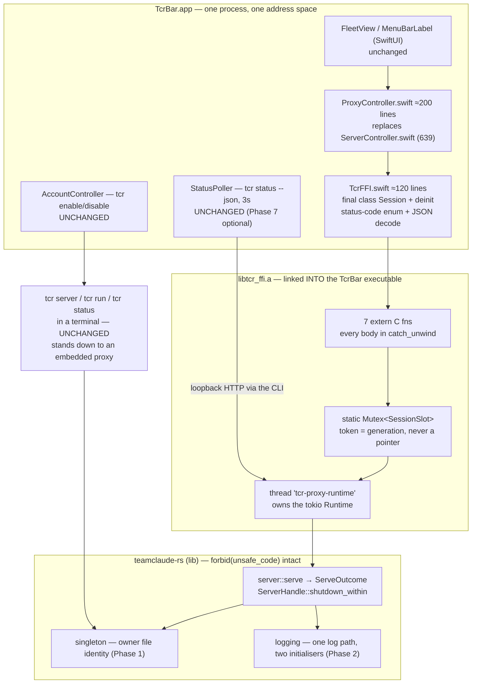

# Target state: the tcr proxy in-process inside TcrBar

Design delta, 2026-08-08. Read-only survey; no source edited. Companion to — and in
three places a correction of — `docs/design/ffi-in-process-target-state.md`.

**The decision is made:** the proxy goes inside the app. This document does not
re-score Approach A against Approach C. It designs A, states what A actually costs
(which is narrower than the prior doc claims in one place and wider in another),
and names the one prerequisite without which A ships a silent OAuth-token-loss bug.

> **Committable to a public repo.** No account data, UUIDs, credentials or paths
> outside this checkout appear below. No source from the private sibling repo is
> reproduced — only observations about it and its own recorded judgements.

**One fatal-if-skipped finding, up front.** `singleton::classify_proxy_server`
identifies a proxy by matching `argv[0]` against `tcr` / `/tcr`
(`src/singleton.rs:70,83`). A proxy living inside TcrBar has `argv[0]` ending in
`/TcrBar`, so it is invisible to every consumer of that function. The consequence
that matters is not the ugly one — it is that `live_proxy_server` returns `None`, so
`tcr login` stops refusing to run beside a live server, and the proxy's next
`persist_tokens` writes its boot-time tokens back over the fresh ones
(`src/singleton.rs:137-144` states exactly this failure). **Phase 1 fixes identity
before anything links the FFI.** σ3 — read both the matcher and the caller.

---

## 1. Correcting the prior doc's framing

### 1.1 "A permanently destroys the proxy-outlives-GUI property" — scoped much narrower than it reads

`ffi-in-process-target-state.md:11-13,276,289,306-310,515-518` treats this as the
deciding property. Read against the app as it exists today, it survives in exactly
one configuration, and the app's own doc-comments say so:

- `TcrBarApp.swift:88-95` — `AppDelegate.applicationWillTerminate` calls
  `server?.terminateSupervisedChildOnQuit()`. The type-level comment at `:84-87` is
  unambiguous: *"Exists for one reason: a child process TcrBar spawned must not
  outlive it."*
- `ServerController.swift:386-388` — `terminateSupervisedChildOnQuit()` is `stop()`;
  `stop()` at `:377-383` guards on the `child` field, so it signals only a process
  this app spawned. An incumbent it merely observed is never touched.
- `TcrBarApp.swift:40-50` — `startServerAtLaunch`, whose comment says that paired
  with launch-at-login *"the proxy is simply always up — but it also makes Quit
  expensive, because once TcrBar supervises the server, quitting stops it."*

So **today, in the configuration the app's own documentation describes as the
intended steady state, quitting TcrBar already stops the proxy.** The property
survives only for a proxy TcrBar did not start — a terminal `tcr server`, or a
leftover from a previous TcrBar process. σ3 (read both files; both statements are
the code's, not my inference).

The accurate statement of A's cost is therefore:

| Configuration | Today | Under A |
|---|---|---|
| TcrBar starts the proxy, operator quits via the menu | proxy **stops** (`TcrBarApp.swift:93`) | proxy stops |
| TcrBar starts the proxy, TcrBar is force-quit / crashes | proxy **survives, orphaned** | proxy dies with the app |
| Terminal `tcr server` holds the port, TcrBar observes it | proxy survives Quit | **proxy survives Quit** — preserved |
| Operator wants a GUI-independent proxy | run `tcr server` in a terminal | **run `tcr server` in a terminal** — preserved |

Two rows change, and one of them is the row the app's `AppDelegate` was written to
eliminate. The orphan-survives-a-crash case is not a property being lost; it is the
defect `TcrBarApp.swift:84-87` names. What A genuinely removes is the *option* of
"TcrBar starts a proxy that then outlives TcrBar" — which no supported path
currently produces anyway.

What A **does** cost, and the prior doc does not say: relaunching TcrBar after a
rebuild now necessarily bounces the proxy, where today an operator can quit and
relaunch the app while a terminal-started incumbent keeps serving. The mitigation is
that the terminal path is untouched and the app stands down to it cleanly (§6) — so
GUI-independent operation remains an available configuration, just not the default
one. That is a real regression in convenience and it should be stated as such rather
than argued away.

### 1.2 Prior doc §5's `build-tcrbar.sh` warning is wrong

`ffi-in-process-target-state.md:541-544` warns that `build-tcrbar.sh:110,133` `cp`s a
binary over a path something is executing. It does not: `rm -rf "$app_dir"` at
`build-tcrbar.sh:108` unlinks the entire bundle before `mkdir -p` at `:109`, so both
`cp`s at `:110` and `:133` create new inodes. The `Code Signature Invalid` hazard
recorded in `CLAUDE.md` requires an **in-place** overwrite of a file being executed,
which this script structurally cannot do. σ3 — read the script in order.

### 1.3 Prior doc phases 1-3 have all landed

Its Phase 1 (golden JSON fixture) is in the tree — `.github/workflows/ci.yml:99-101`
reads `tests/fixtures/status-contract.json` from the Swift side. Phase 2 (macOS CI
job) is `ci.yml:59-104`, and it was proven to fail before being trusted (`d4a84a2`
broke a Swift assertion, `5ec5187` reverted it). Phase 3 is `src/server.rs`, merged as
PR #41 at `origin/main` 78554f4. The delta below therefore starts from a much better
position than the prior doc was written against.

---

## 2. What PR #41 supplies — verified at file:line

Each of the four pieces the brief named, confirmed by reading `src/server.rs` at
78554f4. σ3 for each: read directly, but I also interpreted them, so σ2 caps any
claim about *behaviour I did not execute*.

**`serve(ServeOptions) -> anyhow::Result<ServeOutcome>`** — `src/server.rs:486`.
`ServeOutcome` at `:204-210` is `Started(ServerHandle) | StoodDown(StandDown)`. The
stand-down is returned as data at `:544-549`, carrying `port`, `pid`,
`cli::IncumbentProbe` and `build_info::StandDownReport` (`:191-201`). The module
doc-comment at `:1-15` states the two things removed from `run_server`: no
`process::exit`, and it returns as soon as the listener is bound. This is exactly
what lets the app render "another proxy holds the port" from a struct rather than
from an exit code plus a grepped sentence.

**`IncumbentPolicy`** — `src/server.rs:67`, a newtype over the private `enum Signal`
(`:72-81`, deliberately unnameable outside the module). Three named constructors:
`never_signal()` `:89`, `replace_legacy_js_only()` `:97`,
`kill_the_incumbent_proxy()` `:108`. `Default` yields `Never` (`:74`), and the
doc-comment at `:52-66` states the property being bought: "follow the docs and you
cannot kill anything." `signals_anything()` at `:114` exists so a caller can assert
it holds the harmless one. This constrains the FFI design hard — see §4.3.

**`ServerHandle::shutdown_within(grace)`** — `src/server.rs:386`. Sends the watch
signal, then joins the accept loop and each background task under a single
`timeout_at` deadline, aborting and counting anything that misses it (`:390-421`),
then `persist_now()` and a final affinity flush (`:423-428`). The doc-comment at
`:363-385` says why the deadline is not optional — the affinity flusher performs a
blocking `std::fs` write inside async code — and documents cancel-safety. It **cannot
hang**. The handle owns the accept loop plus the affinity flusher, quota prober and
keep-warm loops (`:295-303`, spawned at `:602`, `:637`, `:661`), and `Drop` aborts
all of them (`:470-479`).

**`affinity_path: Option<PathBuf>`** — `src/server.rs:159`. `None` means in-memory
only: nothing restored at boot, nothing written at shutdown (`:571`, `:440-445`). The
doc-comment at `:150-158` explains why `None` is the default — the binary's path is
one shared file, and a second process that serves briefly would atomically replace
the live proxy's pin map with its own.

Two more facts that matter and are not in the brief:

**`serving_stopped()`** — `src/server.rs:330`. Resolves when the accept loop stops on
its own, which its own comment says "in practice means it panicked"; pends forever
afterwards so it is safe in a `select!` arm. **This is the supervisor hook the panic
contract needs, and it already exists.**

**`AffinityFlush`** — `src/server.rs:237-246`. Three states, not `Option<usize>`,
because the doc-comment at `:230-235` names the exact silence being broken: an
embedder with no tracing subscriber never sees the warning that the pin write failed.
That type was written for this design's caller.

---

## 3. The prerequisite: proxy identity is name-based and must stop being

### 3.1 What breaks

`classify_proxy_server` (`src/singleton.rs:63-92`) splits `ps -p <pid> -o command=`
output on whitespace (`process_command`, `:95-103`) and requires `tokens[0]` to be
`tcr` or to end with `/tcr` (`:70`, `:83`). A proxy inside TcrBar reports
`…/TcrBar.app/Contents/MacOS/TcrBar` and matches nothing, so it is not an
`Incumbent` (`:124-135`). Three consequences, each traced to its call site:

**(a) `tcr login` clobbers fresh tokens. Silent. This is the one that makes it a
prerequisite rather than a polish item.** `live_proxy_server` (`:145-151`) returns
`None`, so the guard whose own doc-comment (`:137-144`) says *"`tcr login` uses it to
REFUSE to run beside a live server (the server reads config only at boot, and its
next `persist_tokens` writes its boot-time TOKENS back over the file, clobbering the
login's fresh ones)"* stops firing. Anthropic's refresh tokens are single-use
(`src/server.rs:137-141` restates this), so the loss is not recoverable by retrying.

**(b) A terminal `tcr server` fails with a raw bind error instead of a clean
stand-down.** With the default policy it reaches `takeover_port(port, false)`
(`src/server.rs:520`), which finds a non-proxy holder, prints `[tcr] :3456 is held by
a non-proxy process (pid N): …/TcrBar — not replacing it; the bind will fail if it
stays.` (`src/singleton.rs:272-274`), returns `Takeover::Proceed`, and then
`TcpListener::bind` fails (`src/server.rs:712-714`) → exit 1 with an anyhow context.
No `INCUMBENT_MARKER`, no exit 0/3/4. Every consumer of the stand-down contract
(`src/main.rs:482-497`, `tcr && next-step`, and the tests pinning them) regresses in
precisely the configuration A makes normal.

**(c) `tcr server --replace` stops being the documented recovery.** It also cannot
recognize the holder, so it will not signal it — which is *correct*, but the operator
is left with a failed bind and no path forward.

### 3.2 The fix: identity by the proxy's own advertisement

Three options were considered. Committing to the third.

| Option | Cost | Why not / why |
|---|---|---|
| Extend the matcher to also accept `…/TcrBar` | ~5 lines | Re-creates the exact class this codebase keeps paying for: an unchecked cross-language string contract. Breaks if the bundle is renamed, and the app's *name* becomes a Rust constant. |
| Probe the holder over HTTP for identity | large | `cli::probe_incumbent` is async and needs the API key, but `takeover_port` is sync and deliberately runs *before* the `Manager` exists (`src/server.rs:501-513`). Wrong layer. |
| **An owner file the proxy writes at bind time** ← chosen | ~90 lines + tests | Name-free, host-agnostic, and it makes identity the proxy's own *claim* rather than an inference from `argv`. A stale file cannot produce a false positive, because the pid must also appear in `port_listeners(port)`. |

Design: after a successful bind, `serve()` atomically writes
`proxy-owner-<port>.json` next to the affinity pin cache, containing
`{"pid":N,"port":P,"sha":"…","host":"cli"|"embedded"}`, and removes it in
`shutdown_within`. `singleton` gains `classify_port_owner(port, holders)`, consulted
*before* the name matcher and returning `ProxyKind::Tcr` for `host:"cli"` or a new
`ProxyKind::TcrEmbedded` for `host:"embedded"`. Name matching is **retained** as the
fallback — for a `tcr` predating the owner file (including the proxy currently
serving) and for `LegacyJs`, which will never write one.

`host` comes from a new `ServeOptions` field, not from sniffing `argv[0]`: the FFI
passes `embedded`, `main.rs::run_server` passes `cli`. The library never guesses.

### 3.3 An embedded proxy is deliberately NOT replaceable — and this follows existing precedent

`incumbents_to_signal` never returns a `TcrEmbedded`; `takeover_decision` returns
`IncumbentPresent` for one even under `--replace`, with a message naming the app as
the place to stop it.

This is not a new policy. `classify_proxy_server` already returns `None` for
`tcr run` (`src/singleton.rs:87`), which is why a proxy hosted inside a `tcr run`
process is never replaced — and `ServerController.swift:83-90,483-486` already
renders that outcome, citing `src/singleton.rs:38,62`. A proxy hosted inside a GUI is
the same shape, and it deserves the same treatment for a stronger reason:
`takeover_port` SIGTERMs the pid (`src/singleton.rs:301`), and AppKit installs no
SIGTERM handler, so `--replace` against an embedded proxy would kill the menu bar app
without running `applicationWillTerminate` at all. A CLI flag must not be able to do
that. σ2 for the AppKit signal-disposition claim — that is default-disposition
reasoning, not something I executed here.

The operator's recovery for a wedged embedded proxy is the app's own Stop/Restart,
which is strictly better than `--replace`: in-process it is a bounded
`shutdown_within` plus a fresh `serve()`, so the pin map gets its final flush instead
of dying to a SIGKILL.

---

## 4. The FFI surface

### 4.1 Mechanism: a hand-rolled C ABI with an integer session token

**Not swift-bridge. Not uniffi. σ2** — this is a design judgement grounded in read
code, not an executed comparison.

Requirements derived from what exists:

- One long-lived stateful object spanning app-launch → Quit: a tokio runtime plus a
  `ServerHandle`. Nothing in the prior art has ever carried this
  (`ffi-in-process-target-state.md:64-69`).
- A separate crate is mandatory: `src/lib.rs:8` is `#![forbid(unsafe_code)]`.
- The surface is deliberately frozen and JSON-encoded, because the structured data
  already has a pinned contract on both sides (`tests/fixtures/status-contract.json`).
- No new SwiftPM dependency: `ci.yml:92-94` records that the package declares zero
  external dependencies, and that is worth keeping.

| Mechanism | Verdict |
|---|---|
| **swift-bridge** | Rejected. Its one directly on-point precedent is a **rejection** of exactly this shape: `docs/plans/lattice-v1-blueprint.md:242-246` declines a stateful opaque type over swift-bridge for "cross-FFI lifetime + thread-safety", at σ2, and that was for a *stateless text engine*. Its opaque-type mechanism hands Swift a `Box::into_raw` pointer — the rejected shape itself. New build+runtime dep. |
| **uniffi** | Rejected for now, but this is the surviving alternative. Closer than the prior doc implies (its Swift backend emits a `.swift` + header + modulemap and needs no runtime package), but it buys a proc-macro/UDL layer and a bindgen build tool for a 7-function surface, and its async story would need a foreign-executor shim we do not otherwise want. Revisit if the surface ever exceeds ~10 functions or needs real structs. |
| **Hand-rolled C ABI** ← chosen | 7 `extern "C"` functions moving `int32_t`, `uint64_t` and `char*`. **Zero new dependencies** (`std::ffi::{c_char, CStr, CString}` covers it). And it is the only option that lets the handle be a token instead of a pointer. |

The decisive argument is not size, it is this: **neither codegen tool removes the two
costs that actually hurt.** Link-flag re-derivation from
`rustc --print native-static-libs` and cargo-must-run-before-swift ordering are
properties of static linking, not of the binding generator — the prior art hit both
with swift-bridge in place (`ffi-in-process-target-state.md:70-87`). Paying a
dependency for something that does not remove the cost is the worst available trade.

One genuine advantage of `staticlib` over any dylib option, given this repo's build:
the archive links *into* the TcrBar executable, so no new nested Mach-O appears in the
bundle and `build-tcrbar.sh:243-258`'s sign-nested-before-outer ordering needs no
change at all.

### 4.2 How the long-lived handle crosses: a token, never a pointer

```
typedef uint64_t TcrSession;   /* 0 is never a valid session */
```

Rust side owns a `static SESSION: Mutex<SessionSlot>` where `SessionSlot` is
`{ generation: u64, state: Starting | Serving(Inner) | StoppedAt(u64) | Died(String) }`.
`tcr_serve_start` increments `generation` and returns it. Every other call takes the
token and matches it against the current generation.

This answers the `lattice-v1-blueprint.md:242-246` objection rather than overriding
it. That rejection was about cross-FFI *lifetime* and *thread-safety*; a token removes
both:

- **Lifetime** lives entirely in Rust. Swift holds a `UInt64`. There is nothing to
  free, nothing to double-free, nothing to dangle. A stale token — from a stopped
  session, a re-entrant call, or Swift zero-initialising a struct — is a clean
  `TCR_ERR_NO_SUCH_SESSION`, distinguishable from `TCR_ERR_NOT_SERVING`.
- **Thread-safety** is one `Mutex` that Rust owns. Swift may call from any thread; the
  ordering guarantee is the mutex's, not a convention documented in a comment.
- **At most one session ever exists.** A second `tcr_serve_start` while occupied is
  `TCR_ERR_ALREADY_SERVING` — it cannot produce a second proxy, which is the whole
  point of the singleton.

### 4.3 The surface

```c
/* crates/tcr-ffi/include/tcr_ffi.h — hand-written; a Rust test pins symbol parity */

typedef uint64_t TcrSession;

/* Status codes. Mirrored by a Swift enum; each numeric value pinned by a Rust test,
   the same discipline as ServerController.StandDownExit. */
enum {
  TCR_OK                    = 0,
  TCR_ERR_BAD_ARGUMENT      = 1,
  TCR_ERR_ALREADY_SERVING   = 2,
  TCR_ERR_NO_SUCH_SESSION   = 3,
  TCR_ERR_NOT_SERVING       = 4,
  TCR_ERR_BIND_FAILED       = 5,
  TCR_ERR_START_TIMEOUT     = 6,
  TCR_ERR_START_PANICKED    = 7,
  TCR_ERR_PANIC             = 8,
  TCR_ERR_LOG_UNAVAILABLE   = 9
};

int32_t     tcr_log_init(const char *log_path_or_null);
int32_t     tcr_serve_start(const char *options_json, TcrSession *out_session, char **out_json);
int32_t     tcr_serve_stop(TcrSession session, uint32_t grace_ms, char **out_json);
int32_t     tcr_serve_state(TcrSession session, char **out_json);
int32_t     tcr_status_json(TcrSession session, char **out_json);
const char *tcr_build_sha(void);   /* 'static, never freed */
const char *tcr_log_path(void);    /* 'static after tcr_log_init */
void        tcr_string_free(char *s);
```

Conventions, all load-bearing:

- Every function returns `int32_t`, never `bool`. A bool cannot distinguish
  "no session" from "not serving" from "panicked", and collapsing those is how a
  wedged server gets displayed as healthy — the defect class this app has already
  paid for twice (`ServerController.swift:337-353`).
- Every `char**` out-param is either left NULL or set to a heap `CString` the caller
  passes to `tcr_string_free`. Wrapped Swift-side in a `final class` with `deinit`, so
  no call site handles it.
- `tcr_build_sha()` / `tcr_log_path()` return `'static` strings, never freed. The app
  renders the sha next to the poller's `serverSha` (`FleetView.swift:79`), which turns
  "is the fix live?" into a comparison the panel can make.

**`tcr_serve_start`'s options JSON deliberately has no spelling for the destructive
policy.**

```json
{ "configPath": "…", "port": 3456, "affinity": true, "incumbent": "neverSignal" }
```

`incumbent` accepts `"neverSignal"` and `"replaceLegacyJsOnly"`, and **nothing else** —
there is no string, flag or integer that reaches
`IncumbentPolicy::kill_the_incumbent_proxy()` (`src/server.rs:108`). `ServeOptions`'
safety comes from Rust privacy (`src/server.rs:52-66`) and JSON has no privacy, so the
enforcement has to be that the spelling does not exist in the match. Pinned by a test
asserting (a) an unknown policy string is `TCR_ERR_BAD_ARGUMENT`, and (b)
`signals_anything()` is false for every policy the FFI can construct.

**`tcr_serve_start`'s out JSON is where the stand-down stops being an exit code.**

```json
{ "outcome": "stoodDown", "port": 3456, "pid": 41234,
  "line": "…build_info::StandDownReport::line…",
  "liveness": "answering" | "silent", "verdict": "inSync|stale|dirtyBuild|unknown" }
```

The three facts that `EXIT_STOOD_DOWN_OK/STALE/NOT_ANSWERING` (`src/main.rs:482-497`)
encoded as integers become two named fields. The app's three existing states —
`.incumbentHoldsPort`, `.incumbentIsStale`, `.incumbentNotAnswering`
(`ServerController.swift:36-48`) — map 1:1 onto them, so **their carefully-written
operator prose at `:70-98` survives verbatim.** Only how the fact arrives changes.
That is what keeps the deletion in §7 cheap.

`tcr_serve_stop`'s out JSON is `ShutdownReport` (`src/server.rs:266-277`) including
the `AffinityFlush` discriminant, so the UI can say "pins lost" when
`AffinityFlush::Failed` fires. That type exists for this caller (`:230-235`).

---

## 5. Runtime ownership

**The Rust side owns the runtime, on a dedicated OS thread. The app's main thread
never blocks on it — not at start, not at stop.**

`tcr_serve_start`:

1. Lock the session slot; if occupied → `TCR_ERR_ALREADY_SERVING`.
2. `std::thread::Builder::new().name("tcr-proxy-runtime").spawn(…)` — that thread
   builds a `tokio::runtime::Builder::new_multi_thread().enable_all()` runtime,
   `block_on`s `serve(options)`, sends the outcome back over a `std::sync::mpsc`
   channel, then parks in `select!` over {stop signal, `handle.serving_stopped()`},
   and on stop runs `shutdown_within(grace)` and returns the report.
3. The FFI call blocks on the mpsc receive only until the *outcome* is known — bounded
   by construction, because `serve()` returns as soon as the listener is bound
   (`src/server.rs:8-11`). It still gets its own 10s cap, because the boot path can
   legitimately take seconds: `takeover_port` sleeps 800ms + 300ms
   (`src/singleton.rs:302-306`) and `probe_incumbent` does an HTTP round-trip
   (`src/server.rs:526`). On timeout the slot stays occupied and marked `Starting`, so
   a retry gets `ALREADY_SERVING` rather than starting a second proxy — a leaked
   thread that finishes and self-cleans is strictly better than two listeners.

Swift calls it from `Task.detached`, never the main actor — the same discipline
`StatusPoller.pollOnce` (`StatusPoller.swift:106`) and
`ServerController.startTakingOverPort` (`ServerController.swift:305-317`) already use
for blocking work.

Why a dedicated thread and not a runtime on the main thread: `block_on` on the main
thread blocks the AppKit run loop, and `Runtime::shutdown_timeout` in
`applicationWillTerminate` does the same. This is the concrete answer to the prior
doc's "it is the hardest part and has no good answer"
(`ffi-in-process-target-state.md:337-345`) — the answer is that the app never blocks
on the runtime because the runtime is not on its thread, and `shutdown_within`, which
did not exist when that doc was written, makes the stop bounded by construction.

### Lifecycle map

| App event | What happens |
|---|---|
| **Launch** (`onAppear` + `startServerAtLaunch`, `TcrBarApp.swift:72-75`) | `Task.detached` → `tcr_serve_start`. The `didAttemptLaunchStart` once-guard (`:55`) is retained verbatim — `onAppear` still fires on every panel open. |
| **Menu open / close** | Nothing. The runtime is not tied to the panel's lifetime. |
| **Sleep / wake** | Nothing to do, and nothing new: this is the same code that runs in the child today. The affinity flusher and warmer already use `MissedTickBehavior::Skip` (`src/server.rs:605,664`) so a suspended process does not burst a catch-up sweep on wake. |
| **Quit** (menu / Cmd-Q) | `applicationWillTerminate` → `tcr_serve_stop(session, grace_ms: 2000)`, **synchronous, blocking, on the main thread.** See below. |
| **Force-quit / crash / SIGKILL** | No shutdown path runs. Pins survive via the 5s debounced flusher — the mechanism that exists for exactly this (`src/server.rs:593-598`). |

**Quit needs a stated budget, and 2000ms is not `DEFAULT_SHUTDOWN_GRACE`.** That
constant is 5s (`src/server.rs:34`), chosen for a CLI quitting into a shell. An app
inside `applicationWillTerminate` is under a macOS watchdog, so the grace is passed
explicitly — which is precisely why `shutdown_within` takes it as a parameter
(`:363-385`). Worst case is 2s plus one synchronous atomic pin write, and
`shutdown_within` **cannot hang**: a task that misses the deadline is aborted and
counted in `tasks_aborted` (`:396-410`).

Doing this asynchronously and returning from `willTerminate` immediately is the wrong
answer: the process exits and the final flush never runs. Blocking for a bounded 2s
is the trade, and it is the same trade `TcrBarApp.swift:92-94` already makes with
`Process.terminate()`.

---

## 6. Port contention

### 6.1 A terminal `tcr server` already holds :3456, then the app starts

`serve()` with `neverSignal` takes the detection-only branch
(`src/server.rs:516-519`) → `live_proxy_server` recognizes the CLI proxy →
`ServeOutcome::StoodDown` with the probe and build report → the FFI returns
`{"outcome":"stoodDown",…}`. The app renders the incumbent's pid, its build line and
its liveness, using its existing three states and their existing wording
(`ServerController.swift:36-48,70-98`).

**The app does not offer to take the port.** "Take over port…", its confirmation
alert, the capability probe and all three argv vectors are *deleted*, not re-plumbed.
The panel says what `ServerController.swift:73-79` already says for
`takeoverRefused`: the holder must be stopped from its own terminal. That is a
subtraction, and it is the largest single one in §7.

### 6.2 The app holds :3456 in-process, then a terminal `tcr server` runs

**After Phase 1:** `classify_port_owner` reads the owner file, finds
`host:"embedded"` with a pid that is a live port listener, and returns
`ProxyKind::TcrEmbedded` → `takeover_decision` → `IncumbentPresent` → clean
stand-down: `INCUMBENT_MARKER` on stderr (`src/singleton.rs:233,247`), exit 0/3/4
(`src/main.rs:639-642`), `tcr && next-step` behaves, and `--replace` refuses with a
message naming the app. `tcr login`'s guard fires again.

**Before Phase 1:** EADDRINUSE, exit 1, and silent OAuth token clobbering. This is
§3, and it is why Phase 1 is Phase 1.

### 6.3 Does the `tcr` CLI keep working unchanged? Yes — by construction

`tcr server`, `tcr server --headless`, `tcr run`, `tcr status`, `tcr enable/disable`
are all untouched. `main.rs::run_server` (`:529-615`) keeps spelling out its own
`ServeOptions` (`:539-550`) — including `persist_path`, the shared
`affinity::default_path()`, and the `--replace` mapping — and keeps `stand_down_exit`
(`:623-643`). The FFI is simply a *second* caller of `serve()`, exactly as
`tests/serve_library_path.rs:106` already is.

The only CLI-visible change is additive: the singleton recognizes one more kind of
incumbent, and refuses to signal it. Every existing recognition test
(`src/singleton.rs:311+`) must stay green — that is the Phase 1 gate.

---

## 7. Logging — where the proxy's output goes with no stdout and no `--headless`

### 7.1 The gap, precisely

`--headless` selects the *subscriber*, not a serving parameter — `ServeOptions`'
doc-comment says so explicitly (`src/server.rs:126-130`). `init_tracing(headless)`
(`src/main.rs:736-765`) calls `.init()`, which installs the **process-global** default
subscriber and can only succeed once. In-process there is no `--headless` flag, no
pipe, and no stdout worth writing to.

### 7.2 Design

1. **Move `log_file_path()` (`src/main.rs:682-684`) and `open_log_file()` (`:691-698`)
   into the library** as `src/logging.rs`, behaviour byte-identical:
   `std::env::temp_dir().join("teamclaude-rs.log")`, opened
   `create(true).append(true).mode(0o600)` because the log holds account emails and
   request paths (`:686-690`).
2. **Do not change the path.** Measured with `rg`: 29 occurrences across **23 files**
   in this checkout hardcode `$TMPDIR/teamclaude-rs.log` — 20 of them under
   `scripts/` (log-triage, cache-audit, gcra-replay, the 529 attribution set,
   `validate-cache.sh:125`, and two findings notes), plus
   `ServerController.swift:348`, `src/server.rs:717-725` and `src/main.rs:682-683`.
   Moving it would silently blind all of them, and silence is the failure mode this
   section exists to prevent.
3. **Add `pub fn init_embedded_logging(log_path: Option<&Path>) -> LogInit`**, using
   `try_init()` rather than `init()` so a second call is a reported no-op instead of a
   panic, and returning the resolved path plus whether a subscriber was already
   installed. **File sink only, no stdout layer** — this is the in-process analogue of
   the TUI branch (`src/main.rs:755-764`), which is already file-only for the same
   reason, and an `LSUIElement` app's stdout is either nowhere or the system log,
   which is not where a line naming an account email belongs.
4. **`tcr_log_path()` returns the resolved absolute path, and the app shows it.** Two
   panel actions: "Copy log path" and "Reveal in Finder"
   (`NSWorkspace.selectFile(_:inFileViewerRootedAtPath:)`). The operator reads the
   same file as always; the app removes the need to re-derive `TMPDIR` by hand. **This
   is the fix for the class of bug that cost a day** — the answer to "where are the
   logs" is rendered in the UI, not reconstructed from a shell variable.
5. **The `TMPDIR` divergence risk, named and gated rather than assumed.**
   `std::env::temp_dir()` reads `$TMPDIR` and falls back to `/tmp`. Measured on this
   machine: `$TMPDIR` equals `getconf DARWIN_USER_TEMP_DIR`
   (`/var/folders/…/T/`), and the live log is there. A Finder- or login-item-launched
   GUI app inherits launchd's `TMPDIR`, which is that same per-user path, so the two
   should resolve identically — **σ2: I measured the terminal side and the file's
   existence; I did not measure the GUI side and did not launch the app.** The
   `log_path_or_null` parameter exists precisely so that if the Phase 5 gate finds a
   divergence, the app passes an explicit path instead of the design needing a
   rewrite.
6. **The boot marker survives untouched.** `serve()` emits `server started` with
   sha/pid/port after a successful bind (`src/server.rs:732-740`). In-process `pid`
   becomes TcrBar's pid — which is exactly the fact an operator needs, and
   `rg 'server started' "$TMPDIR/teamclaude-rs.log"` keeps working as the restart
   counter the comment at `:717-731` describes.

### 7.3 The part the child-process design got for free: `eprintln!`

Three boot-path diagnostics go to **stderr, not tracing**, and in-process stderr goes
nowhere an operator will look:

- `src/singleton.rs:272-274` — the non-proxy-holder line, which is the single most
  diagnostic sentence in the port-contention story.
- `src/singleton.rs:283` (`stand_down_message`) — the `INCUMBENT_MARKER` line.
- `src/main.rs:627,631-637` — the stand-down diagnosis and the
  incumbent-not-answering warning.
- `src/main.rs:655-668` — `load_config`'s corrupt-file warning, which in-process is
  the difference between "no accounts configured" and "your config is unreadable and
  will not be overwritten".

The precedent for the fix is already in the file. `takeover_port` pairs its replace
`eprintln!` with a `tracing::info!` at `src/singleton.rs:300`, and the comment at
`:296-299` gives the reason: *"in TUI mode this eprintln lands on a terminal that the
alternate screen is about to cover, so the durable log is the only place a takeover is
recoverable."* An embedded host is that argument with the volume turned up. Extend the
pairing to the other sites; keep every `eprintln!` so the CLI is unchanged. σ3 — read
all four sites and the existing paired-tracing precedent.

The stand-down facts themselves need no logging fix: they already cross as
`StandDown` data, which is what `ServeOutcome` is for.

---

## 8. Target structure



### Boundary contracts

| Boundary | Contract | Checked by |
|---|---|---|
| Swift ↔ `libtcr_ffi.a` | `int32_t` status codes + JSON strings + a `uint64_t` token | Rust test pinning every numeric code; a header/symbol parity test; a mirrored Swift enum |
| `tcr-ffi` ↔ `teamclaude-rs` | Ordinary Rust: `serve`, `ServerHandle`, `ServeOutcome` | the compiler |
| App ↔ proxy status | `tcr status --json`, unchanged | `tests/fixtures/status-contract.json`, read by both sides (`ci.yml:99-101`) |
| CLI ↔ embedded proxy | the owner file + `INCUMBENT_MARKER` + exit codes 0/3/4 | `src/singleton.rs:459-487`-style literal-pinning tests, extended |
| Cargo ↔ SwiftPM | `cargo build -p tcr-ffi` must precede `swift build`; link path from `cargo metadata` | the CI link canary (Phase 4) |

The link path is read out of `cargo metadata --no-deps` `.target_directory`, exactly as
`build-tcrbar.sh:119-127` already does and already documents why. Hardcoding
`target/debug` is the latent bug still unfixed in the prior art
(`ffi-in-process-target-state.md:74-78`); this repo already knows better and the script
proves it.

---

## 9. Phased migration

Eight phases, 0 through 7. Each is independently shippable and leaves
`cargo test --all` plus `swift build && swift test` green. **Only Phase 6 requires a
proxy restart.** Pins now
persist across a bounce (`src/server.rs:560-570` restores before the listener binds),
so a restart costs the prompt-cache prefix, not the pin map.

### Phase 0 — pair every boot-path `eprintln!` with `tracing`. Rust only.

Sites: `src/singleton.rs:272-274`, `:283`; `src/main.rs:627,631-637`;
`src/main.rs:655-668`. Add `tracing::warn!`/`info!` beside each; delete no `eprintln!`.

**Gate:** `cargo test` green, plus a new test that drives `takeover_port` with an
injected non-proxy holder and asserts the warn event fires. Break the `tracing` line
and watch it go red before believing it.
**Restart:** none. **Blast radius:** two files, additive only.

### Phase 1 — host-agnostic proxy identity. Rust only. THE PREREQUISITE.

Owner file written by `serve()` after a successful bind and removed in
`shutdown_within`; `classify_port_owner` consulted before the name matcher;
`ProxyKind::TcrEmbedded` never signalled; new `ServeOptions.host` field set explicitly
by each caller.

**Gate:** `cargo test singleton::` green with four new cases, each of which must be
watched to fail first:
(a) an owner file whose pid is **not** in `port_listeners(port)` is ignored — the
stale-file false-positive control;
(b) `host:"embedded"` yields `IncumbentPresent` even for `replace = true`;
(c) `incumbents_to_signal` returns empty for a `TcrEmbedded`;
(d) every pre-existing recognition test at `src/singleton.rs:311+` still passes.
Plus a `tests/` integration test that runs `serve()` on port 0 with a temp owner path
and asserts the file appears and is gone after `shutdown()`.
**Restart:** none. The live proxy has written no owner file, so the retained name
matcher covers it until it is next restarted.

### Phase 2 — logging as a library concern. Rust only.

`src/logging.rs` holding the moved `log_file_path`/`open_log_file` plus
`init_embedded_logging(Option<&Path>) -> LogInit` on `try_init()`.

**Gate:** `cargo test logging::` — the resolved path equals
`std::env::temp_dir().join("teamclaude-rs.log")` (pinning it so a later refactor cannot
silently move it away from the 23 files that read it); a second
`init_embedded_logging` returns `AlreadyInstalled` instead of panicking; the file is
created `0600`. The existing path assertion at `src/main.rs:1091-1092` stays green.
**Restart:** none.

### Phase 3 — workspace + `crates/tcr-ffi`. No app change; nothing links it yet.

Add `[workspace] members = ["crates/tcr-ffi"]` to the **existing root** `Cargo.toml` —
the root package stays where it is, so `cargo build --manifest-path
"$repo_root/Cargo.toml" --release --bin tcr` (`build-tcrbar.sh:126`) and
`cargo metadata --no-deps` `.target_directory` (`:127`) both keep working unchanged.
New crate with `crate-type = ["staticlib","rlib"]`, the 7 functions, the session slot,
the runtime thread, the hand-written header.

**Gate:** five checks, and (a) and (c) are the ones that matter:
(a) `cargo test -p tcr-ffi` includes a **round-trip through the `extern "C"`
signatures themselves** — start on port 0 with `affinity: false`, read state, call
`tcr_status_json`, stop, assert the `ShutdownReport` JSON, `tcr_string_free` every
returned pointer. The FFI's behaviour tested with no Swift in the picture.
(b) a **header/symbol parity test**: read `include/tcr_ffi.h`, compare the declared
symbol set against the exported set; an added function with no header entry fails
`cargo test`. Two sets compared, not prose grepped.
(c) a **panic-containment test**: feed an entry point an input that trips a
`#[cfg(test)]`-gated panic, assert `TCR_ERR_PANIC` and that the process survives.
Construct the failure and watch it fire — a `catch_unwind` that has never caught
anything is not a gate.
(d) a test reading `CARGO_MANIFEST_DIR`'s `Cargo.toml` and asserting **no `panic` key
in any `[profile.*]`** (§10 item 3).
(e) `cargo build --release --bin tcr` still yields a binary carrying the checkout sha,
i.e. `build-tcrbar.sh:143-152`'s existing assertion still passes. That is the
workspace-conversion gate.
**Restart:** none.

### Phase 4 — CI proves the static link before any Swift depends on it.

Extend the existing `macos` job (`ci.yml:59-104`) with `cargo build -p tcr-ffi
--release`, a captured `rustc --print native-static-libs -p tcr-ffi` (logged for the
same attribution reason `ci.yml:88-90` logs `swift --version`), and a ~20-line C or
Swift `main` compiled against `libtcr_ffi.a` + the header that calls
`tcr_build_sha()` and runs.

**Gate:** the job is green on a PR **and** a throwaway commit that removes one entry
from the link flags makes it red. Precedent for exactly this discipline is in the
history: `d4a84a2` broke a Swift assertion to prove the job could fail, `5ec5187`
reverted it.
**Restart:** none.

### Phase 5 — TcrBar links the FFI. Embedded mode off by default.

`Package.swift` gains a `CTcrFFI` system-library target and the link config;
`build-tcrbar.sh` runs `cargo build -p tcr-ffi --release` **before** `swift build`
(`:103-104`) and passes the `cargo metadata` target directory as the link path. New
`ProxyController.swift` + `TcrFFI.swift` land **alongside** the existing
`ServerController.swift`; a `UserDefaults` key `ProxyMode` selects `child` (default)
or `embedded`. Nothing is deleted.

**Gate:** `swift build && swift test` green with the existing 641-line
`TakeoverIntentTests.swift` untouched. Then, on the machine and **costing nothing**:
set `ProxyMode=embedded` with the live proxy still serving, launch a dev build, and
confirm the panel renders the incumbent's pid and build line. That exercises the
entire stand-down path against the live proxy without touching it — standing down
signals nothing (`src/server.rs:516-519`). Then confirm `tcr_log_path()` as shown in
the panel is **string-equal** to `"$TMPDIR/teamclaude-rs.log"` in a terminal; if not,
pass the explicit path (§7.2 item 5).
**Restart:** none.

### Phase 6 — flip the default and delete the supervision code. ONE RESTART.

Default `ProxyMode=embedded`; delete the 492 lines itemised in §10 plus ~440 of
`TakeoverIntentTests.swift`; `AppDelegate` calls the bounded stop; remove
"Take over port…" and its alert.

**Gate:** `cargo test --all` and `swift build && swift test` green, then in this order
on the machine:
1. With the live proxy up, launch → panel shows the incumbent; `tcr status --json`
   still reports `source=live`.
2. Stop the terminal proxy, click Start → panel shows serving; `tcr status --json`
   reports `source=live` and the pid is **TcrBar's**.
3. `rg 'server started' "$TMPDIR/teamclaude-rs.log" | tail -1` shows the new boot line
   with that pid — the log gate, end to end.
4. Run `tcr server` in a terminal → it must print `another proxy holds` and exit 0.
   This is Phase 1's gate observed in production, and it is the check to run first if
   anything looks wrong.
5. Quit TcrBar → the port refuses, and
   `rg 'session-affinity pins written' "$TMPDIR/teamclaude-rs.log" | tail -1` shows
   the final flush with a non-zero pin count.

**Restart: YES, one, operator-scheduled.** Cost is the prompt-cache prefix only.
Schedule it when no long session is mid-flight.

### Phase 7 — optional, gated on measurement: retire the 3s subprocess poll.

`tcr_status_json` reads the in-process `Manager` (`src/server.rs:313`) and renders the
*same* `render_accounts_json`, so `Fleet.decode` and its 864 + 382 lines of Swift
decode tests are untouched. Used only when `ProxyMode=embedded` **and** the session is
serving; otherwise the subprocess poll remains, because it is the only thing that can
read an *incumbent's* status.

**Gate:** a Rust test asserting the FFI's status JSON decodes against the committed
fixture's schema, plus a before/after wake-up or `powermetrics` measurement. **Do not
start this phase without the measurement** — it buys performance, not correctness.
**Restart:** none.

---

## 10. Deletion table and the honest line count

Measured against `apps/macos/Sources/TcrBarCore/ServerController.swift` at 639 lines
(the prior doc's cited line numbers are 5-6 lines stale; these are re-derived).

| Symbol | Lines | Count |
|---|---|---|
| `safeArguments` / `takeoverArguments` / `legacyTakeoverArguments` + docs | `:125-174` | 50 |
| `ReplaceFlagSupport` | `:176-180` | 5 |
| `takeoverArgumentSet` | `:182-198` | 17 |
| `replaceFlagSupport(inHelpText:)` | `:200-222` | 23 |
| `probeReplaceFlagSupport` | `:224-235` | 12 |
| `probeTimeout` + `support(within:)` (the semaphore workaround) | `:237-276` | 40 |
| `serverArguments` | `:278-280` | 3 |
| `startTakingOverPort` | `:286-319` | 34 |
| `launch` | `:321-329` | 9 |
| `spawn` (pipes, `nullDevice`, termination handler) | `:331-373` | 43 |
| `stop` / `terminateSupervisedChildOnQuit` | `:375-388` | 14 |
| `incumbentMarkers` | `:390-412` | 23 |
| `Intent` | `:414-422` | 9 |
| `StandDownExit` | `:424-444` | 21 |
| `unknownArgumentMarkers` | `:446-468` | 23 |
| `classifyExit` | `:470-532` | 63 |
| `ChildStderr` | `:535-594` | 60 |
| `LockedSupport` | `:596-614` | 19 |
| `LockedString` | `:616-639` | 24 |
| **Swift deleted from `ServerController.swift`** | | **492** |
| `TakeoverIntentTests.swift` — the argv/exit-code/stderr half | | **~440** |
| **Swift added** — `ProxyController.swift` ≈200 (the `State` enum and its operator prose at `:29-113` largely survive) + `TcrFFI.swift` ≈120 + `Package.swift` ≈15 | | **+335** |
| **Net Swift** | | **−597** |
| **Rust added** — `crates/tcr-ffi` ≈350 + header ≈60 + ffi tests ≈250 + Phase 1 ≈170 + Phase 2 ≈60 + Phase 0 ≈20 | | **+910** |

**So this is not a net deletion, and the prior doc's "≈900-1,100 lines deleted"
framing should not be carried over to A.** The honest headline is a *relocation*:
roughly 930 lines of Swift process-supervision — a language with one macOS CI job and
no fuzzing, mutation testing, miri or tsan — become roughly 910 lines of Rust covered
by `cargo test --all` on ubuntu **and** macOS on every push, plus `clippy -D warnings`,
`cargo audit`, tsan and miri (`ci.yml:22-56,106-175`). The value is coverage and
type-safety relocation, not line count. Anyone selling A on deletion is selling the
wrong thing.

Two orphans to delete in the same commit or they linger: `LockedString`
(`:616-639`, used only by `ChildStderr`) and `LockedSupport` (`:596-614`, used only by
`support(within:)`).

---

## 11. Panic containment — the one invariant A genuinely gives up

### 11.1 The baseline, verified

`Cargo.toml:66-73` defines `[profile.release]` (`opt-level`, `lto`) and
`[profile.dist]` (`inherits`, `lto`) and **sets no `panic` key in either; there is no
`[profile.dev]` at all.** So unwinding is live, and a panic inside a `tokio::spawn`ed
task unwinds that task and is captured by its `JoinHandle` as a `JoinError`. σ3 — the
profile is read directly; the tokio semantics are standard but I did not execute them
here, and my own reading of code I also interpreted caps at σ2 for anything
behavioural.

That baseline is necessary and **not sufficient** in-process, for five distinct
reasons:

| Panic site | Today (child process) | In-process, without a contract | With the contract |
|---|---|---|---|
| Per-connection task | one request dies | one request dies | unchanged |
| Accept loop task | proxy stops serving; child stays alive | proxy stops serving; app alive but silent | `serving_stopped()` fires → state `.panicked` |
| Background loop (prober / warmer / flusher) | silent degradation | silent degradation | `panic::set_hook` writes to the durable log |
| `serve()`'s own prologue (`block_on`) | child exits 1 | **would take the app** | runtime *thread* unwinds; thread dies, process lives |
| An `extern "C"` body | does not exist | **aborts the process** (unwinding out of `extern "C"` is a hard abort) | `catch_unwind` → `TCR_ERR_PANIC` |

### 11.2 The contract

1. **Every `extern "C"` function body is wrapped in
   `std::panic::catch_unwind(AssertUnwindSafe(…))`, without exception**, returning
   `TCR_ERR_PANIC`. This is the one thing worth copying verbatim from the prior art
   (`ffi-in-process-target-state.md:350-354`). Enforced by the Phase 3 gate (c), which
   constructs a panic and watches it be caught.
2. **`panic = "abort"` is permanently forbidden in every profile** — `release`,
   `dist`, `dev`, `bench` and any future one — with the reason written into
   `Cargo.toml` as a comment, not only into a doc: under `abort`, `catch_unwind`
   catches nothing and one `unwrap` in a background task SIGKILLs the menu bar.
   Enforced structurally by the Phase 3 gate (d), which reads the manifest and asserts
   a fact about the file rather than grepping anyone's prose.
3. **The runtime lives on its own `std::thread`, which is a panic boundary as well as
   a scheduling one.** A panic in `serve()`'s prologue unwinds that thread; the mpsc
   sender drops; the blocked FFI call gets `Err(RecvError)` → `TCR_ERR_START_PANICKED`.
   A designed path, not an incidental one.
4. **`std::panic::set_hook` writes the panic payload and location to the durable log
   before unwinding.** Without it a caught panic is invisible, and a background loop
   that died silently is the "hung server displayed as healthy" class again. Installed
   by `init_embedded_logging`, so it cannot be forgotten separately.
5. **`#![forbid(unsafe_code)]` stays on `src/lib.rs:8`.** `crates/tcr-ffi` needs
   `unsafe` in exactly two places — `CStr::from_ptr` on inputs and
   `CString::into_raw`/`from_raw` on outputs — each behind a null check that returns
   `TCR_ERR_BAD_ARGUMENT`, each with a `SAFETY:` comment, and the crate carries
   `#![deny(unsafe_op_in_unsafe_fn)]`.
6. **The UI must never render a dead server as idle.** `ProxyController.State` gets
   `.panicked(detail:)` distinct from `.stopped`, and the menu-bar glyph goes to the
   existing unreadable state (`TcrBarApp.swift:114-115`, `Tok.unreadableGlyph`). A
   panel that reports a wedged proxy as fine is worse than one that reports nothing —
   the codebase has paid for this twice (`ServerController.swift:337-353`,
   `StatusPoller.swift:4-7`).
7. **No automatic restart loop. σ2 — this is my judgement, and it is Gil's call.** On
   `serving_stopped()` firing, the runtime thread logs, sets `Died`, and stops. It does
   **not** re-`serve()`: a restart re-runs `takeover_port`/`live_proxy_server`, and a
   loop against a port it cannot bind is a spin; the pin map is already gone either
   way; and the app is right there with a button. The alternative worth naming is a
   bounded restart — max 3, exponential backoff — mirroring the `KeepAlive: {Crashed:
   true}` reasoning in the prior doc (`ffi-in-process-target-state.md:418-430`). Pick
   one before Phase 5; do not let it be decided by whoever writes the code.

### 11.3 A cost the prior doc does not name: the app stops being credential-free

`TcrTool.swift:4-9` states the current property outright — the app shells out to the
CLI and never speaks HTTP *because* the status endpoint requires the proxy API key and
"a menu-bar app has no business holding that secret," and it "also never reads the tcr
config file."

In-process that property is gone by construction: TcrBar's address space contains the
config, every account's OAuth access and refresh tokens, and the proxy API key. This
is not a blocker — the operator already trusts the app, and the tokens are already in
a process on the same machine — but it changes the app's threat model and three things
follow:

- **No debug/diagnostic action may dump config or memory.** No "copy config", no
  "export state", no verbose panel that renders a token prefix.
- **The FFI's JSON surface must never carry a token.** `render_accounts_json` already
  does not; the Phase 3 round-trip test should assert the *absence* of any
  token-shaped field rather than assuming it.
- **The durable log stays `0600`** (`src/main.rs:691-698`), and crash-report
  suppression is worth a look before Phase 6 — a `sysdiagnose` from a GUI app is a
  broader artifact than one from a CLI child.

---

## 12. Do-not list

**Do not ship the embedded path before Phase 1.** Without host-agnostic identity,
`tcr login` runs beside the in-process proxy and its fresh single-use refresh tokens
are clobbered by the proxy's next `persist_tokens` — the exact failure
`src/singleton.rs:137-144` exists to prevent, and it is silent. This is the single
highest-risk over-reach available here: everything else in this document fails loudly.

**Do not make the handle a raw pointer.** Integer token into a Rust-owned slot. The
prior art's rejection (`docs/plans/lattice-v1-blueprint.md:242-246`) is about
cross-FFI lifetime and thread-safety, and a token removes both rather than arguing
with them. A `Box::into_raw` opaque type is the rejected shape itself.

**Do not adopt swift-bridge or uniffi for a 7-function frozen surface.** Neither
removes the two costs that actually hurt — link-flag re-derivation and
cargo-before-swift ordering — and both are new dependencies requiring Gil's approval.

**Do not set `panic = "abort"`. Ever. In any profile.** In-process, `catch_unwind` is
the only thing between one `unwrap` and a dead menu bar.

**Do not expose `kill_the_incumbent_proxy()` through the FFI** — not as a string, a
flag or an integer. `IncumbentPolicy`'s safety is Rust privacy (`src/server.rs:52-66`)
and JSON has no privacy, so the enforcement must be that the spelling does not exist
in the match.

**Do not let a CLI flag kill the GUI.** `--replace` must refuse an embedded incumbent,
following the precedent already set for a `tcr run`-hosted proxy
(`src/singleton.rs:87`, rendered at `ServerController.swift:83-90`).

**Do not move the log file.** 23 files in this repo read
`$TMPDIR/teamclaude-rs.log`. Pin the path with a test instead, and surface it in the
UI.

**Do not block the app's main thread on the tokio runtime.** Start goes through
`Task.detached`; stop is a bounded 2s `shutdown_within` — not the 5s
`DEFAULT_SHUTDOWN_GRACE`, which was chosen for a CLI.

**Do not delete the stand-down exit codes or `INCUMBENT_MARKER`.** The app stops being
their consumer; the terminal operator and `tcr && next-step` do not.
`src/main.rs:482-497`, `src/singleton.rs:233` and the tests pinning them all stay —
`src/singleton.rs:459-487`'s *rationale* needs a sentence about its new second
consumer, not deletion.

**Do not sell this as a deletion.** It is −597 Swift for +910 Rust (§10). The case for
A is coverage relocation and typed contracts, and overstating it as line-count savings
invites a reviewer to find the arithmetic and disbelieve the rest.

**Do not reorganise around state that does not exist.** One host, one session, one
port. No second GUI, no remote proxy, no multi-port mode, no second embedder. The
`SessionSlot` holds at most one session on purpose.
